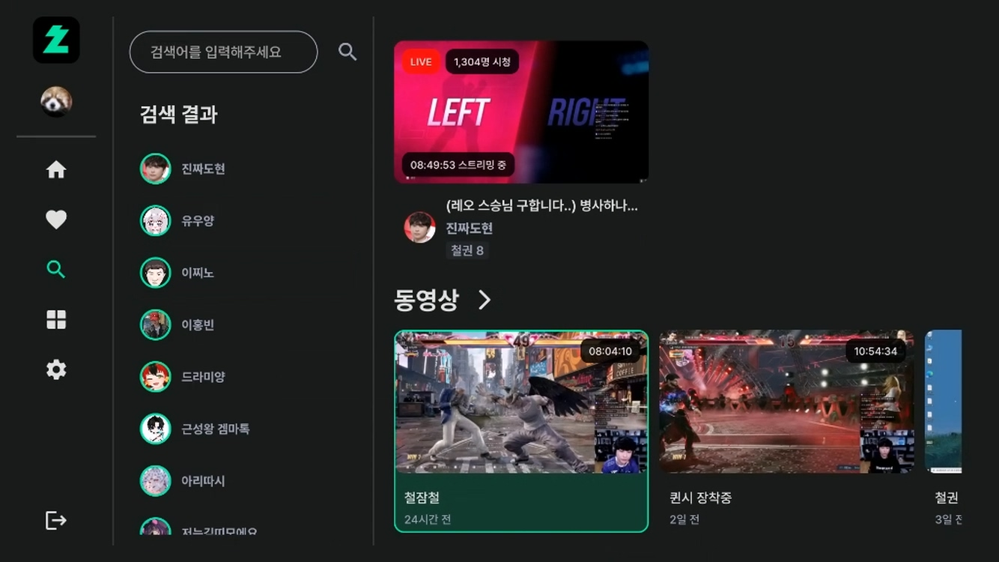
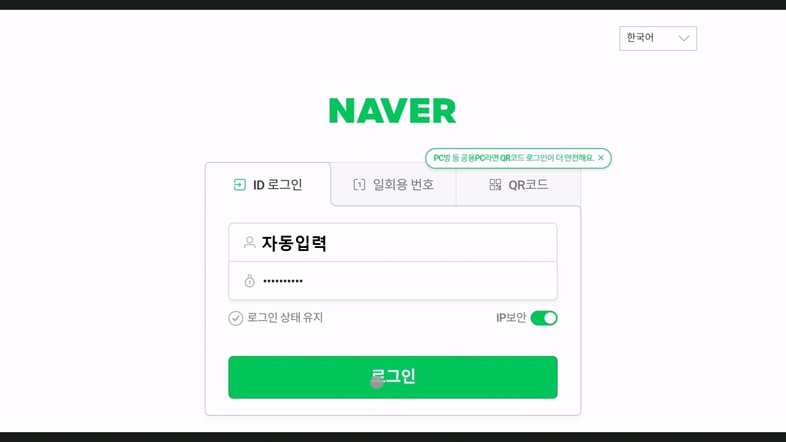
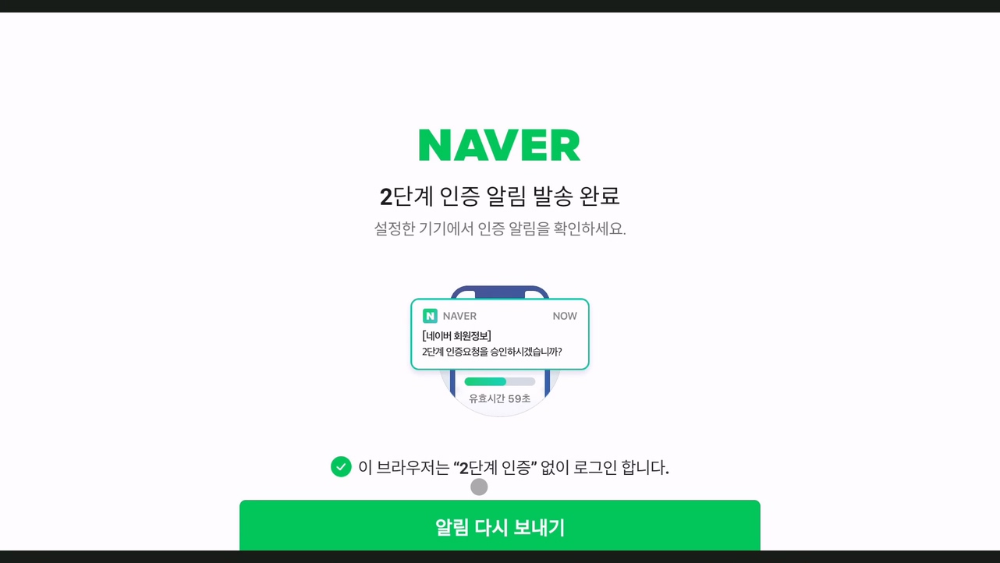

# 치지직 안드로이드 TV 비공식 앱
>치지직 안드로이드 TV 비공식 앱입니다.
>
>치지직 공식 어플이 출시될 때 까지 업데이트할 예정입니다.
>
>문의/제보: escaper.bgp@gmail.com

## 설치 방법
> APK 파일을 다운받아서 수동으로 설치합니다.
>
> 인터넷에 안드로이드 TV APK 설치 등을 검색하시면 쉽게 따라할 수 있는 가이드가 많이 나옵니다. 
>
### 1. 클라우드 이용
> 
> 1) Google drive, DropBox 등 클라우드 스토리지에 APK 파일을 업로드합니다.
> 
> 2) TV의 앱스토어에서 RS 파일 관리자, ES 파일 관리자 등 클라우드 스토리지를 지원하는 파일 관리자 어플리케이션을 다운로드 받습니다.
> 
> 3) 파일 관리자를 통해 APK 파일을 설치합니다.
>
> 
### 2. USB 이용
> 1) USB를 TV에 연결하여 직접 APK 파일을 설치합니다.

### 다운로드
> [APK 파일 다운로드](https://github.com/Escaper-Park/unofficial_chzzk_android_tv/releases/tag/v0.0.2)
>
> TiVo Stream 4K 기준 **chzzkTV-armeabi-v7a-release.apk** 파일로 설치했습니다.
>
> 사용하시는 안드로이드 TV 환경에 따라 설치하시면 됩니다.

## 현재 사용 가능한 기능
>1. 로그인 (WebView)
>2. 팔로우 채널 목록
>3. 인기 채널 목록
>4. 추천 채널 목록
>5. 채널 검색
>6. 라이브 시청
>7. 비디오 시청

## 이용 방법
>팔로우 채널이나, 19금 인증채널을 이용하고 싶다면 로그인해주세요. 
>
>그 외에 기능은 로그인하지 않아도 작동합니다.

## 로그인
>로그인은 정식 출시된 어플이 아니므로 부득이하게 웹뷰를 사용했습니다. (쿠키 사용)
>

## Future Works
>0. 리팩토링 (로직이 지저분하고 코드 중복 많음 0순위 개선사항)
>1. 목록 Pagination (전체보기 버튼 추가)
>2. 라이브 채팅 보기 (채팅 입력은 지원하지 않을 예정입니다. 모바일 앱이나 PC를 이용해주세요.)
>3. 업타임
>4. 멀티뷰
>5. 팔로우 추가/제거 
>6. 로그인 방식 개선 (어려움)
>7. 삼성TV (Tizen OS) 지원 (오래걸림)

### 어플 사용 불편함에 대한 개발자의 핑계
>LCK 시작 일정에 맞춰 개발하느라 시간이 많이 부족했습니다. (개발기간 약 1주일...) 
>
>그리고 TV앱 개발은 처음이라 애로사항이 많습니다...
>
>따라서 여러가지 버그나 불편사항이 있을 수 있습니다. 양해를 부탁드립니다.
