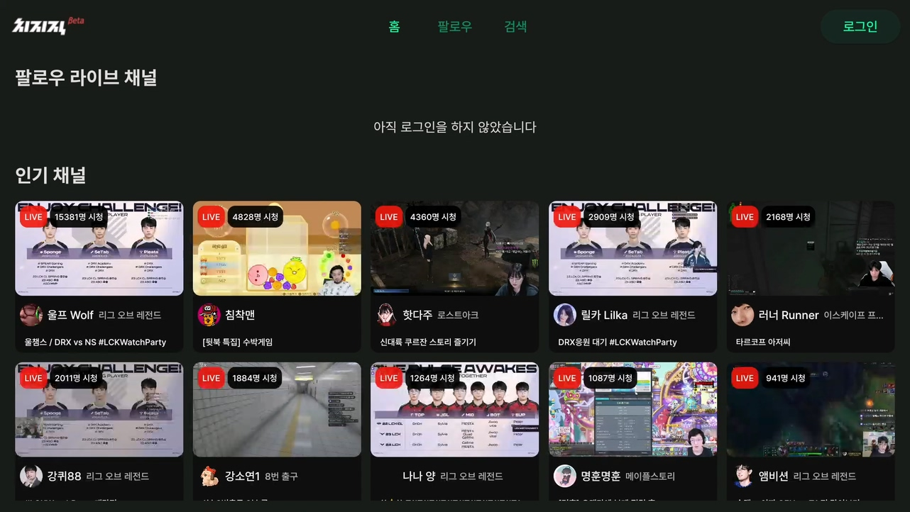
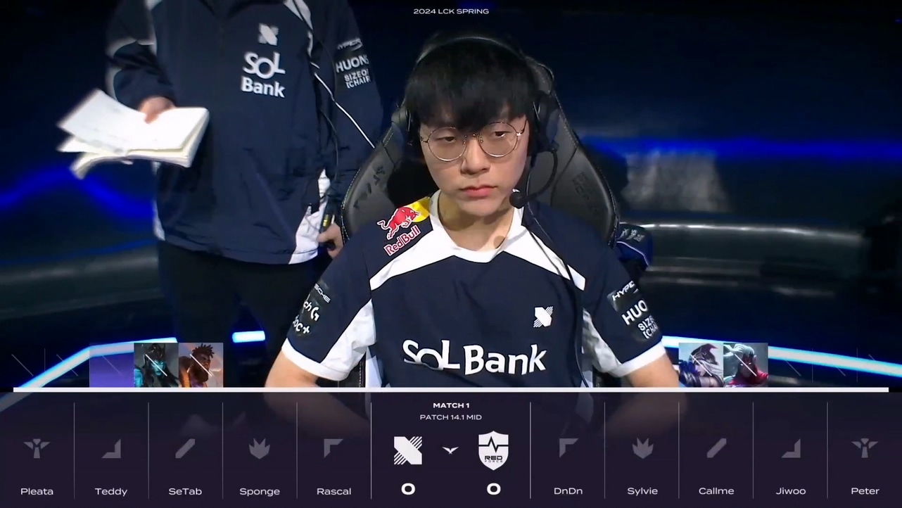
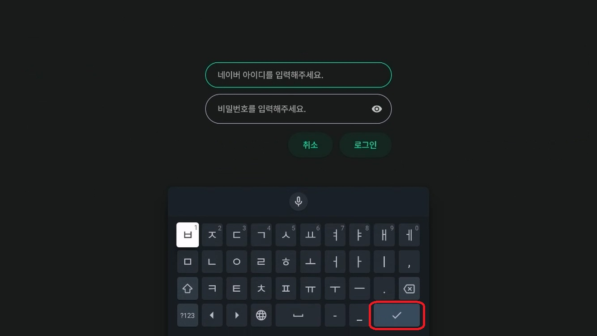

# 치지직 안드로이드 TV 비공식 앱
>치지직 안드로이드 TV 비공식 앱입니다.
>
>치지직 공식 어플이 출시될 때 까지 업데이트할 예정입니다.
>
>문의 및 제보: escaper.bgp@gmail.com




## 핫픽스
### v0.1.1
- 채팅창 Nullable 에러 수정
- 홈 화면 새로고침 버튼 추가
- 로그인 시 아이디 자동 저장
- 홈 버튼으로 앱을 빠져나갔다가 다시 실행했을 때, 실시간 화면으로 재생.
- 홈 버튼으로 앱을 빠져나갔을 때, 백그라운드에서 채팅이 로드되던 현상 수정.
- 앱을 일시정지 했다가 다시 실행헀을 때, 1분 이상 지나면 실시간 화면으로 재생. (1분 전에는 일시정지 했던 시점에서 재생)
- 채팅창 설정 추가 (위치, 채팅창 크기, 글씨 크기 등)



## 패치노트 - v0.1
### 기능 수정 및 추가
- UI 변경
- 로그인 방식 변경 (WebView -> Headless WebView)
- 이미지 로딩 최적화
- 라이브 채팅 보기
- VOD 빨리감기, 되감기
- 멀티뷰(성능 이슈 있음)

### 버그 수정
- 검색창에서 한글이 입력되지 않는 버그 수정
  
- (Android 10 이하)텍스트 입력창 Focus 이후에 리모컨이 작동하지 않는 현상 수정.
(Android 10 이후 버전은 아직 수정하지 못했습니다. [Flutter issue])

## 개발자의 말
- 로그인 버튼 클릭 후 동작이 없으면 **모바일 네이버 앱 알림**을 확인해주세요(2단계 인증). 그래도 진행되지 않는다면 아이디 비밀번호를 다시 확인해주세요. (취소 후 다시 시도)


- Android 11 이상부터 Android 텍스트 입력방식이 바뀌었는데 Flutter(앱 개발 프레임워크)에 100% 대응되지 않은 것 같습니다. 불편하시겠지만 텍스트 입력 시 리모컨 뒤로가기 버튼 대신 가상키보드의 엔터 버튼으로 입력을 부탁드립니다.


- 멀티뷰 시청 시 TV 성능 문제로 인해 프레임 드랍이 있을 수 있습니다. (화질을 낮추면 괜찮을 것 같은데 아직 화질 설정 관련 API를 알아내지 못했습니다. ㅠㅠ) 
  
- 화질 설정 API 관련해서 조언을 부탁드립니다. 도움 주실 수 있는 분은 메일 (escaper.bgp@gmail.com)부탁드립니다. 감사합니다.  

## 설치 방법
APK 파일을 다운받아서 수동으로 설치합니다.

인터넷에 안드로이드 TV APK 설치 등을 검색하시면 쉽게 따라할 수 있는 가이드가 많이 나옵니다. 

### 1. 클라우드 이용
```
1. Google drive, DropBox 등 클라우드 스토리지에 APK 파일을 업로드합니다.

2. TV의 앱스토어에서 RS 파일 관리자, ES 파일 관리자 등 클라우드 스토리지를 지원하는 파일 관리자 어플리케이션을 다운로드 받습니다.

3. 파일 관리자를 통해 APK 파일을 설치합니다.
```

### 2. USB 이용
```
1. USB를 TV에 연결하여 직접 APK 파일을 설치합니다.
```

## 다운로드
[**APK 파일 다운로드 (v0.1.0)**](https://github.com/Escaper-Park/unofficial_chzzk_android_tv/releases/tag/v0.1.0)

TiVo Stream 4K 기준 **chzzkTV-armeabi-v7a-release-v0.1.0.apk** 파일로 설치했습니다.
사용하시는 안드로이드 TV 환경에 따라 설치하시면 됩니다.

## 현재 사용 가능한 기능
- 로그인 (Headless WebView)
- 팔로우 채널 목록
- 인기 채널 목록
- 채널 검색
- 라이브 시청
- 라이브 채팅 보기
- 비디오 시청
- 멀티뷰

## 이용 방법
팔로우 채널이나, 19금 인증채널을 이용하고 싶다면 로그인해주세요. 

그 외 기능은 로그인하지 않아도 작동합니다.

## 로그인
- 로그인은 정식 출시된 어플이 아니므로 부득이하게 [Headless WebView]를 사용했습니다. (쿠키 사용)
- 계정에 2단계 인증이 걸려있다면 로그인 버튼 클릭 후 모바일 알림을 확인해주세요.

## Future Works
- Android 11 이상 Focus Bug Fix
- 화질 설정 (멀티뷰 성능 이슈)
- 멀티뷰 소리조절
- 동영상 목록 전체보기 (Pagination)
- 팔로우 추가/제거
- 삼성TV (Tizen OS) 지원 (오래걸림)

