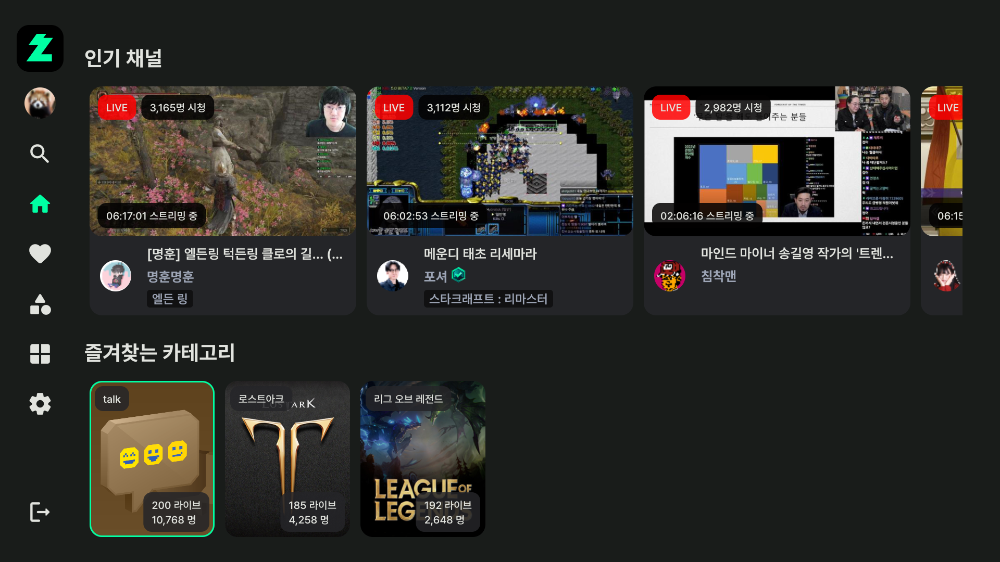
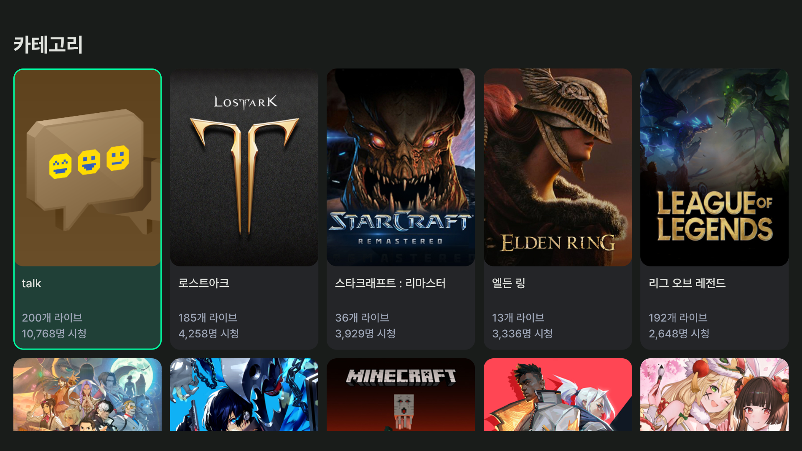

# 치지직 안드로이드 TV 비공식 앱
>치지직 안드로이드 TV 비공식 앱입니다.
>
>치지직 공식 어플이 출시될 때 까지 업데이트할 예정입니다.
>
>문의 및 제보: escaper.bgp@gmail.com




## 업데이트
### v0.2.4
- Gif 이모티콘이 다수 올라올 때 프로그램이 종료되는 현상 수정 (Thanks to @[mero-jung](https://github.com/mero-jung))
- 채팅창 UI 수정

### ~v0.2.3
- 화질 개선을 위해 Low Latency HLS에서 HLS로 변경
- 홈 화면 팔로우, 인기 채널 불러오기 에러 수정
- VOD 시간 탐색시 키 누르고 있으면 계속 이동
- 채널 동영상에서 연령 인증 동영상이 재생되지 않는 현상 수정
- 채팅이 가끔 나오지 않는 현상 수정
- 전체 라이브 페이지 추가 (홈 화면 상단 -> 전체 라이브)
- 기타 기능 및 버그 수정
- HeadlessWebView로 로그인이 진행되지 않는 분들을 위해 WebView 로그인을 추가했습니다. 가상 키보드에 문제가 있으신 분도 WebView 로그인을 사용해주세요. (설정 -> WebView 로그인)

## 패치노트 - v0.2
### 1. 카테고리 검색, 라이브, 동영상, 홈 화면 즐겨찾기(로컬)
### 2. 동영상 전체 다시보기 추가
### 3. 채팅창 이모티콘 대응
### 4. 라이브 시청 중 탐색 기능(인기, 팔로우, 카테고리) 추가
- 라이브 시청 중 위 방향 키패드를 누르면 탐색 창이 나타납니다. 
### 5. 기타 업데이트

## 개발자의 말
- 로그인 버튼 클릭 후 동작이 없으면 **모바일 네이버 앱 알림**을 확인해주세요(2단계 인증). 그래도 진행되지 않는다면 아이디 비밀번호를 다시 확인해주세요. (취소 후 다시 시도)
- 텍스트 입력 시 리모컨 뒤로가기 버튼 대신, 가상키보드의 엔터 버튼으로 입력을 부탁드립니다.
- 유플러스 셋톱박스(또는 다른 TV)에서 리모컨 확인버튼이 클릭되지 않는 경우에 모바일 리모컨 어플리케이션을 통해 사용해주세요.

    [**U+tv리모컨앱 정보**](https://www.lguplus.com/iptv/main-feature/000PPT0036), [**U+tv리모컨앱 iOS**](https://apps.apple.com/kr/app/u-tv-%EB%A6%AC%EB%AA%A8%EC%BB%A8%EC%95%B1/id1637815745), [**U+tv리모컨앱 Android**](https://play.google.com/store/apps/details?id=com.lguplus.remocon&hl=ko&gl=US)

  
## 설치 방법
APK 파일을 다운받아서 수동으로 설치합니다.

인터넷에 안드로이드 TV APK 설치 등을 검색하시면 쉽게 따라할 수 있는 가이드가 많이 나옵니다. 

### 1. 클라우드 이용
```
1. Google drive, DropBox 등 클라우드 스토리지에 APK 파일을 업로드합니다.

2. TV의 앱스토어에서 RS 파일 관리자, ES 파일 관리자 등 클라우드 스토리지를 지원하는 파일 관리자 어플리케이션을 다운로드 받습니다.

3. 파일 관리자를 통해 APK 파일을 설치합니다.
```

### 2. USB 이용
```
1. USB를 TV에 연결하여 직접 APK 파일을 설치합니다.
```

## 다운로드
[**APK 파일 다운로드 (v0.2.4)**](https://github.com/Escaper-Park/unofficial_chzzk_android_tv/releases/tag/v0.2.4)

### 설치 파일
- 대부분 v7a로 설치 가능. 설치 불가시 통합버전 또는 사용하시는 CPU 타입에 따라 설치하시면 됩니다. (가능한 v7a로 설치)

## 현재 사용 가능한 기능
- 로그인 (Headless WebView 또는 WebView)
- 팔로우 채널 목록
- 인기 채널 목록
- 채널 검색
- LIVE 시청
- LIVE 채팅 보기
- VOD 시청
- 카테고리
- 멀티뷰(제한적, 성능 이슈)

## 이용 방법
팔로우 채널이나, 19금 인증채널을 이용하고 싶다면 로그인해주세요. 

그 외 기능은 로그인하지 않아도 작동합니다.

## 로그인
로그인은 정식 출시된 어플이 아니므로 부득이하게 [Headless WebView]를 사용했습니다. (쿠키 사용)

계정에 2단계 인증이 걸려있다면 로그인 버튼 클릭 후 모바일 알림을 확인해주세요