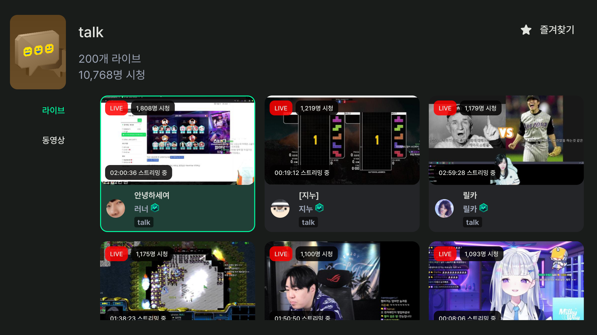
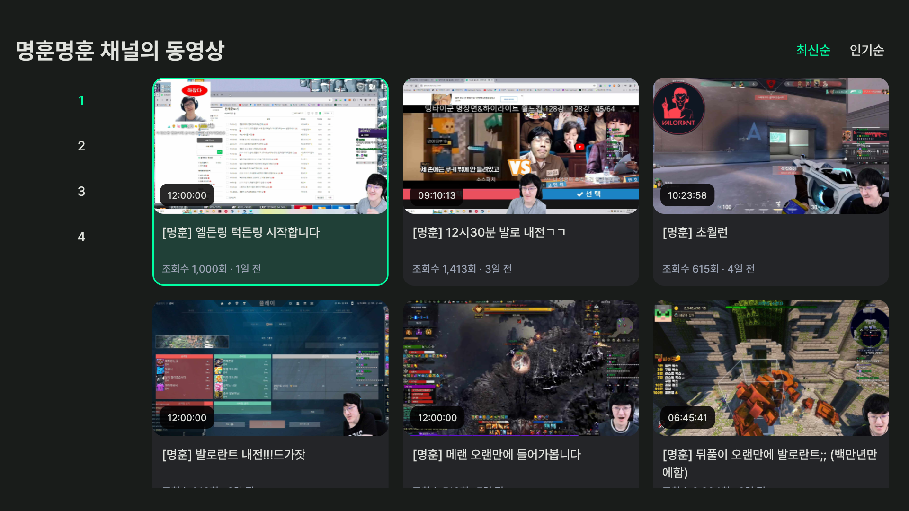
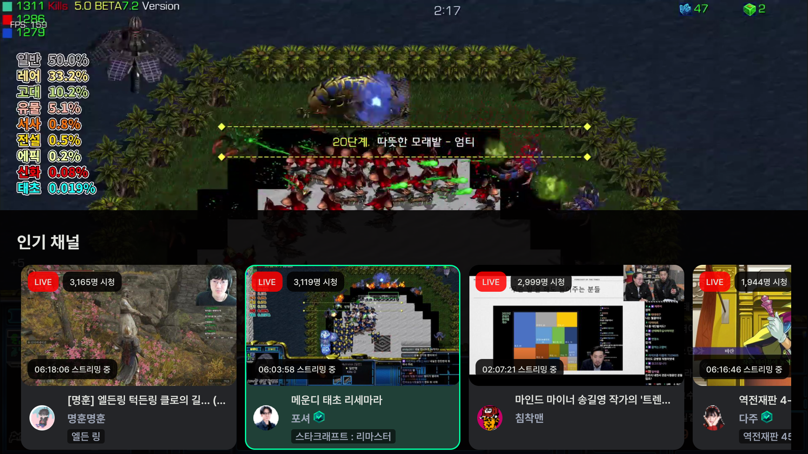
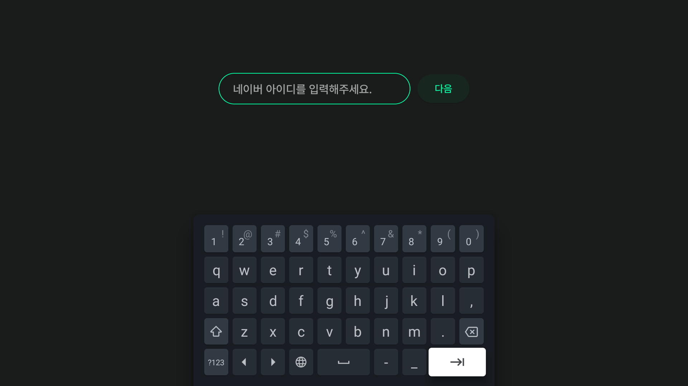

# 치지직 안드로이드 TV 비공식 앱
>치지직 안드로이드 TV 비공식 앱입니다.
>
>치지직 공식 어플이 출시될 때 까지 업데이트할 예정입니다.
>
>문의 및 제보: escaper.bgp@gmail.com






## 패치노트 - v0.2.0
### 1 카테고리 검색, 라이브, 동영상, 홈 화면 즐겨찾기(로컬)
- 홈 화면 즐겨찾기는 로컬 데이터로 저장되기 때문에 캐시를 삭제하면 초기화됩니다.
### 2. 동영상 전체 다시보기 추가
### 3. 채팅창 이모티콘 대응
### 4. 라이브 시청 중 탐색 기능(인기, 팔로우, 카테고리) 추가
- 라이브 시청 중 위 방향 키패드를 누르면 탐색 창이 나타납니다. 
### 5. 기타 업데이트
- 차단 목록이 나타나지 않습니다.
- 로그인 시 성인 인증 채널의 썸네일이 나옵니다.
- 로그인 시 키보드 입력 오류를 피하기 위해 두 화면을 거쳐서 로그인 합니다. (아이디 입력 페이지, 비밀번호 입력 페이지)

## 개발자의 말
- 로그인 버튼 클릭 후 동작이 없으면 **모바일 네이버 앱 알림**을 확인해주세요(2단계 인증). 그래도 진행되지 않는다면 아이디 비밀번호를 다시 확인해주세요. (취소 후 다시 시도)
- 텍스트 입력 시 리모컨 뒤로가기 버튼 대신, 가상키보드의 엔터 버튼으로 입력을 부탁드립니다.


  
## 설치 방법
APK 파일을 다운받아서 수동으로 설치합니다.

인터넷에 안드로이드 TV APK 설치 등을 검색하시면 쉽게 따라할 수 있는 가이드가 많이 나옵니다. 

### 1. 클라우드 이용
```
1. Google drive, DropBox 등 클라우드 스토리지에 APK 파일을 업로드합니다.

2. TV의 앱스토어에서 RS 파일 관리자, ES 파일 관리자 등 클라우드 스토리지를 지원하는 파일 관리자 어플리케이션을 다운로드 받습니다.

3. 파일 관리자를 통해 APK 파일을 설치합니다.
```

### 2. USB 이용
```
1. USB를 TV에 연결하여 직접 APK 파일을 설치합니다.
```

## 다운로드
[**APK 파일 다운로드 (v0.2.0)**](https://github.com/Escaper-Park/unofficial_chzzk_android_tv/releases/tag/v0.2.0)

### 설치 파일
- 사용하시는 티비의 CPU에 따라 설치하시면 됩니다.
- 설치가 되지 않는 다면 다른 버전으로 설치를 시도해보세요.
- 최적화 버전(저용량 파일들)이 설치되지 않는다면 통합 APK 파일로 설치를 시도해보세요. (chzzk-v0.2.0.apk)

## 현재 사용 가능한 기능
- 로그인 (Headless WebView)
- 팔로우 채널 목록
- 인기 채널 목록
- 채널 검색
- LIVE 시청
- LIVE 채팅 보기
- VOD 시청
- 카테고리
- 멀티뷰(제한적, 성능 이슈)

## 이용 방법
팔로우 채널이나, 19금 인증채널을 이용하고 싶다면 로그인해주세요. 

그 외 기능은 로그인하지 않아도 작동합니다.

## 로그인
- 로그인은 정식 출시된 어플이 아니므로 부득이하게 [Headless WebView]를 사용했습니다. (쿠키 사용)
- 계정에 2단계 인증이 걸려있다면 로그인 버튼 클릭 후 모바일 알림을 확인해주세요.

## Future Works
- 화질 설정 (멀티뷰 성능 이슈)
- 멀티뷰 소리조절
- 팔로우 추가/제거
- 삼성TV (Tizen OS) 지원 (오래걸림)

