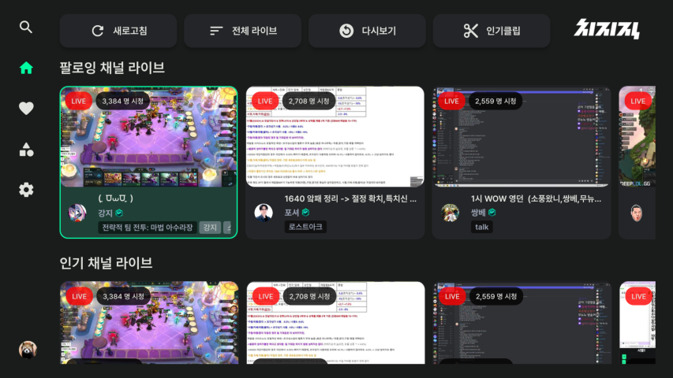

    

**비공식** [치지직] 안드로이드 스마트 TV 어플리케이션입니다.

> [!NOTE]
> 공식 어플리케이션이 출시될 때 까지 업데이트 예정입니다.
>
> 문의 및 제보: escaper.bgp@gmail.com

> [!CAUTION]
> 보안을 위해 이 [GitHub 레포지토리](<https://github.com/Escaper-Park/unofficial_chzzk_android_tv>) 이외의 웹사이트에서 APK 파일을 다운로드 받지 마세요. 

# 목차
- [사용 방법](#사용-방법)
    - [다운로드](#다운로드)
    - [설치 방법](#설치-방법)
        - [클라우드 설치](docs/INSTALL_CLOUD.md)
        - [USB 설치](docs/INSTALL_USB.md)
    - [앱 사용 방법](#앱-사용-방법)
        - [홈 화면](docs/USAGE_HOME.md)
        - [로그인](docs/USAGE_LOGIN.md)
        - [검색](docs/USAGE_SEARCH.md)
        - [채널](docs/USAGE_CHANNEL.md)
        - [카테고리](docs/USAGE_CATEGORY.md)
        - [다시보기](docs/USAGE_VOD.md)
        - [라이브](docs/USAGE_LIVE.md)
        - [설정](docs/USAGE_SETTINGS.md)
- [패치노트](#패치노트)        
- [사용 가능한 기능](#사용-가능한-기능)
- [기타 안내 사항](#기타-안내-사항)

# 사용 방법
## 다운로드
APK 파일 [다운로드] (v0.3.1+2)

위 링크에서 APK 파일을 다운로드하여 TV로 옮겨 설치합니다. 대부분의 TV에서 **v7a** 버전으로 사용 가능합니다.  

## 설치 방법
> [!CAUTION]
> 기존에 설치된 치지직 앱을 삭제하고 설치해주세요.

> [!NOTE]
> 설치에 문제가 있을 경우 [개발자 모드](docs/INSTALL_DEVELOPER.md)로 변경 후 설치를 진행합니다.
>
> 클라우드나 USB 연결을 사용할 수 없으면 TV 웹브라우저에서 직접 다운로드 받거나, [Send Files To TV](https://play.google.com/store/apps/details?id=com.yablio.sendfilestotv&hl=en_US) 앱을 사용해주세요.

* [클라우드 설치](docs/INSTALL_CLOUD.md)
* [USB 설치](docs/INSTALL_USB.md)

## 앱 사용 방법

리모컨 6개 ( :arrow_up: 위, :arrow_down: 아래, :arrow_left: 좌, :arrow_right: 우, :ok: 확인, :leftwards_arrow_with_hook: 뒤로가기 ) 버튼을 사용하여 조작합니다.

- [홈 화면](docs/USAGE_HOME.md)
- [로그인](docs/USAGE_LOGIN.md)
- [검색](docs/USAGE_SEARCH.md)
- [채널](docs/USAGE_CHANNEL.md)
- [카테고리](docs/USAGE_CATEGORY.md)
- [다시보기](docs/USAGE_VOD.md)
- [라이브](docs/USAGE_LIVE.md)
- [설정](docs/USAGE_SETTINGS.md)

# 패치노트 
[v0.3.1+2](docs/CHANGELOG.md)

# 사용 가능한 기능
- 로그인 (Webview 이용)
- 채널 검색
- 팔로잉 채널, 카테고리
- 인기, 팔로우, 카테고리 채널 라이브
- 팔로우/언팔로우
- 라이브(멀티뷰) 시청
- VOD 시청
- 채팅 보기
- 기타

# 기타 안내 사항
> [!NOTE]
> U+(유플러스) 셋톱박스(또는 다른 TV)에서 리모컨 확인 버튼이 작동하지 않는 경우에 모바일 리모컨 어플리케이션을 사용해주세요. 
>
> [**U+tv리모컨앱 정보**](https://www.lguplus.com/iptv/main-feature/000PPT0036), [**U+tv리모컨앱 iOS**](https://apps.apple.com/kr/app/u-tv-%EB%A6%AC%EB%AA%A8%EC%BB%A8%EC%95%B1/id1637815745), [**U+tv리모컨앱 Android**](https://play.google.com/store/apps/details?id=com.lguplus.remocon&hl=ko&gl=US)

> [!CAUTION]
> 보안을 위해 네이버 로그인 2단계 인증을 사용해주세요.

[다운로드]: https://github.com/Escaper-Park/unofficial_chzzk_android_tv/releases/tag/v0.3.1
[치지직]: https://chzzk.naver.com/