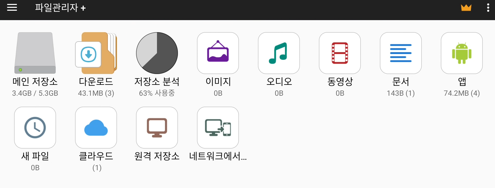
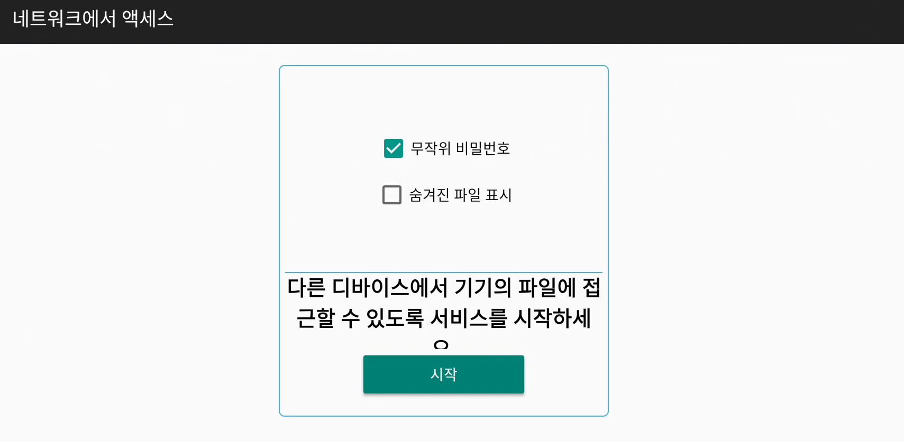
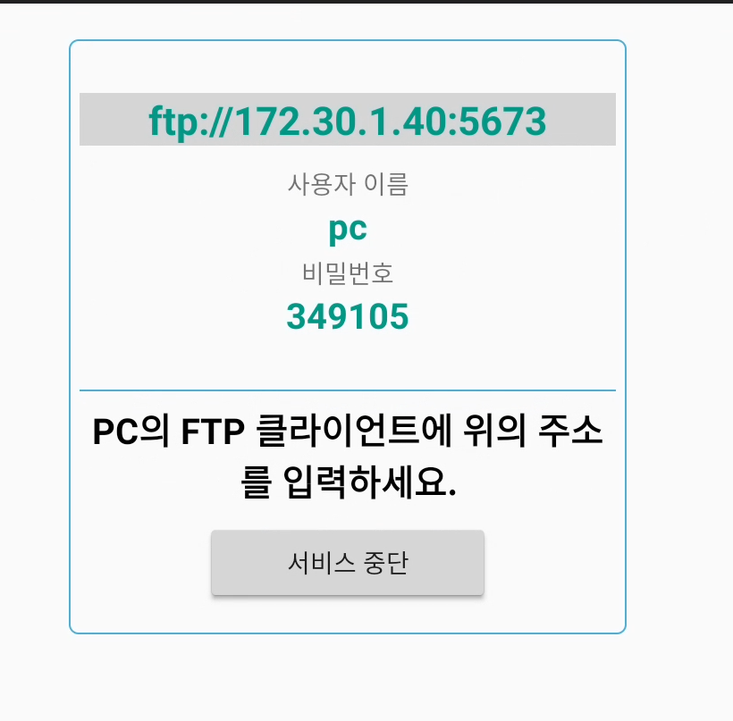
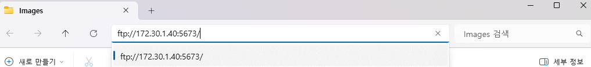
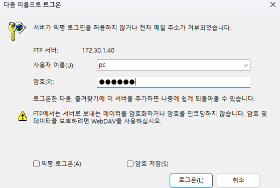
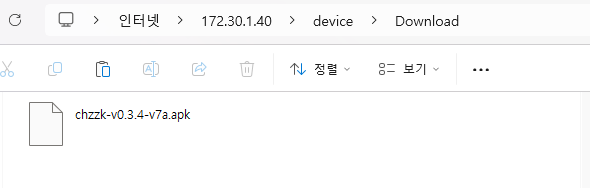

# 네트워크 설치
1. [파일 관리자+](https://play.google.com/store/apps/details?id=com.alphainventor.filemanager&hl=ko), [Send Files To TV](https://play.google.com/store/apps/details?id=com.yablio.sendfilestotv&hl=en_US)와 같은 파일 전송 어플리케이션을 TV에 설치합니다.

2. TV와 같은 네트워크에 연결된(같은 공유기 사용 등) PC, 노트북, 모바일 기기 등에 설치 파일을 다운로드 받습니다.

3. 파일 관리 어플리케이션을 실행한 뒤 네트워크 엑세스와 같은 기능을 찾아 실행합니다.

    

    

4. PC, 노트북에서 아무 폴더를 열고(Mac의 경우 Finder) 주소창에 화면에 나온 ftp 주소를 입력합니다. (ftp://도 입력해야 합니다)
또는 FTP 프로그램을 사용합니다.

    

    

5. 화면에 나온 아이디 비밀번호를 입력합니다.

    

6. 파일을 TV의 다운로드 폴더에 넣습니다.

    

7. 파일 관리 프로그램으로 돌아와 다운로드 폴더에서 APK 파일을 찾아 설치를 진행합니다.

    

