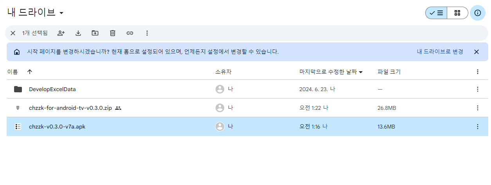
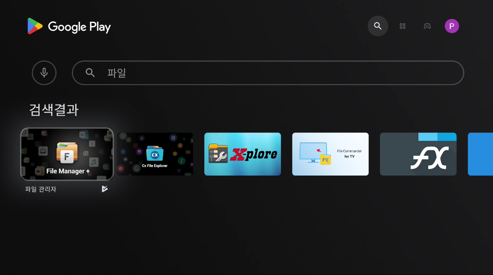
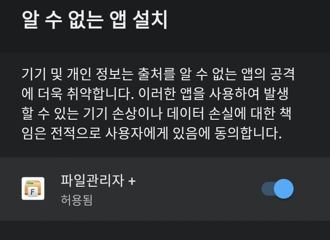

# 클라우드 설치
1. Google Drive 등 개인 Cloud 스토리지에 다운로드한 APK 파일을 업로드합니다.

    

2. Google Play 스토어에서 '파일', '파일 관리자' 등 검색어를 입력하여 파일 관리자 애플리케이션을 설치합니다. 
(파일관리자+, CX 파일 탐색기, X-plore File Manager 등)

    

3. 클라우드 저장소를 파일 관리자에 추가합니다.

    

4. 클라우드 저장소에서 APK 파일을 설치하면 다음과 같은 경고 문구가 나타납니다. 설정을 눌러 알 수 없는 앱 설치 화면에 진입합니다. 

    

5. 파일관리자 애플리케이션을 허용합니다. **알 수 없는 앱 설치에 파일 관리자가 나타나지 않는다면 [개발자 모드](INSTALL_DEVELOPER.md)를 켜줍니다.**

    

6. 파일 관리자 앱으로 돌아가서 다시 설치를 시도합니다.

    

 

