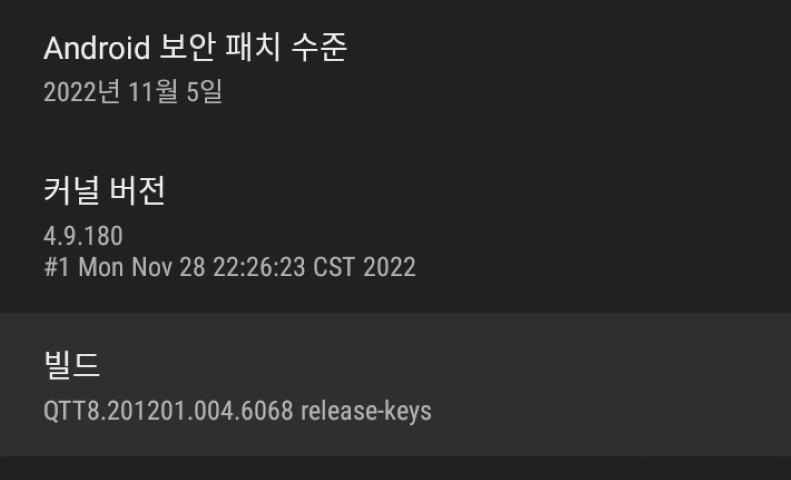
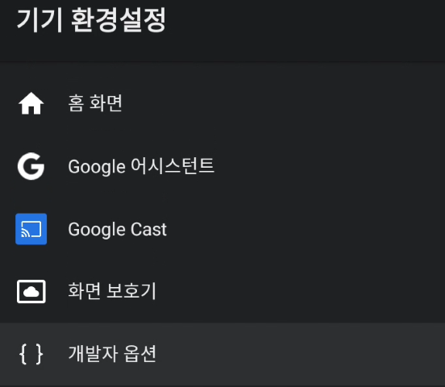
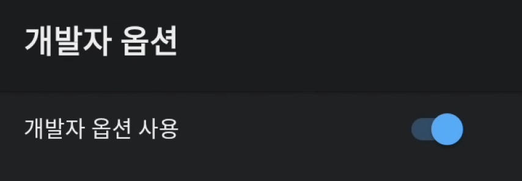
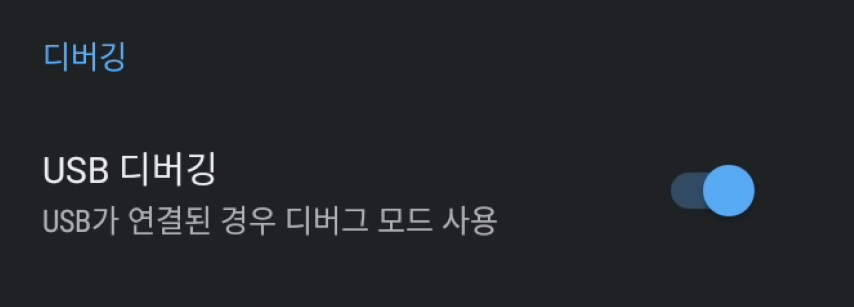

# 개발자 모드
1. 설정 - 기기 환경 설정 - 정보 - 빌드(Android TV OS 빌드)를 개발자 모드가 켜질 때까지 연속해서 클릭합니다.

    

2. 설정 - 기기 환경 설정 - 개발자 옵션에 들어갑니다.

    

3. 개발자 옵션이 꺼져있으면 켜줍니다.

    

4. USB 인식이나 설치에 문제가 있다면 USB 디버깅 옵션을 켜줍니다.

    

