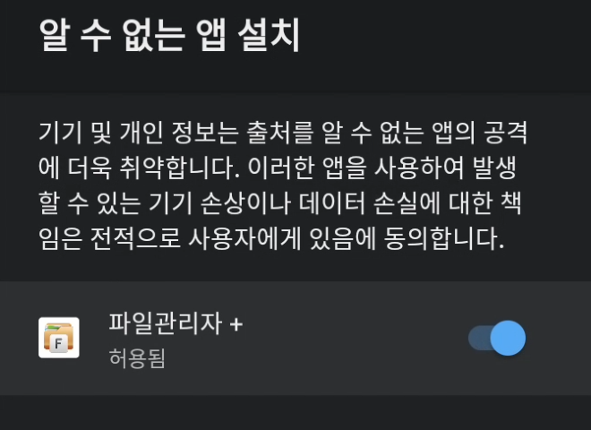

# USB 설치
1. USB에 APK 파일을 다운로드하고, TV에 직접 연결하여 설치합니다.

2. 설치에 문제가 있으면 설정 - 앱 - 보안 및 제한 - 알 수 없는 출처에서 사용 중인 파일 관리자를 허용합니다.

    

3. 알 수 없는 앱 설치에서 목록을 찾을 수 없거나 설치가 안 된다면 [개발자 모드](INSTALL_DEVELOPER.md)를 켜줍니다.

