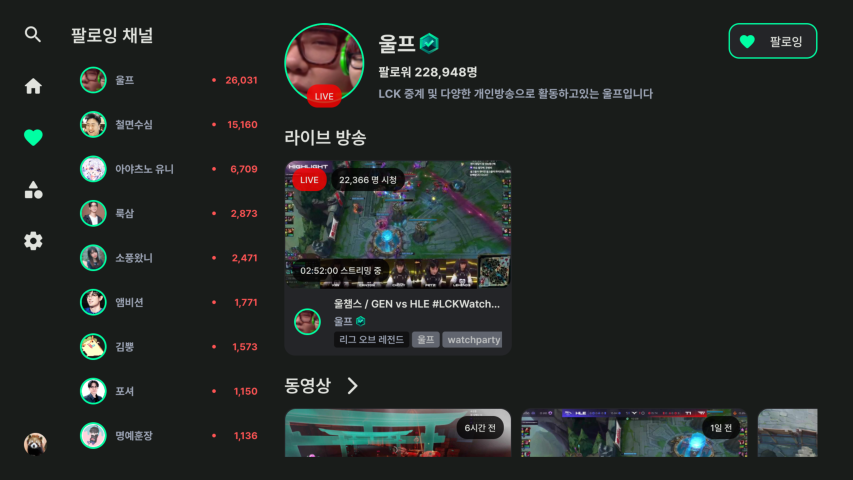
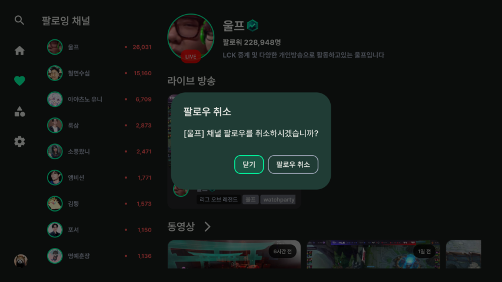
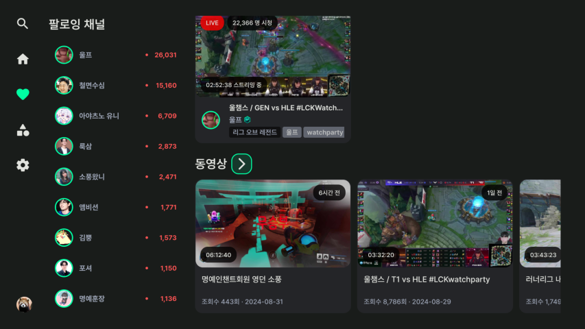
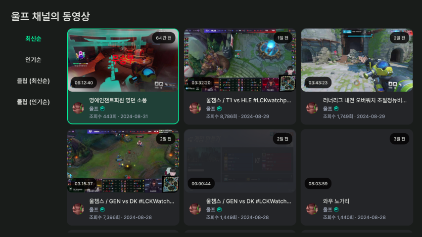

# 채널 소개
검색 결과 또는 팔로잉 채널 목록에서 채널을 선택하여 정보를 확인할 수 있습니다.

- [채널 기능](#채널-기능)
    - [팔로우](#팔로우)
    - [라이브 방송](#라이브-방송)
    - [동영상](#동영상)

# 채널 기능
(언)팔로우, 라이브 방송 보기, 동영상 보기 기능을 사용할 수 있습니다.

## 팔로우

    
    

 

상단의 팔로우 버튼을 누르면 팔로우 할 수 있습니다. 이미 팔로우 되어있는 채널이라면 언팔로우 알림 메시지가 뜨게 됩니다.

## 라이브 방송
해당 채널이 라이브 방송을 하고 있다면 라이브 목록에 나타납니다.

## 동영상

    
    

채널 정보에서 채널의 동영상을 최신순으로 볼 수 있습니다. 전체 영상을 확인하려면 동영상 옆의 > 버튼을 클릭합니다.