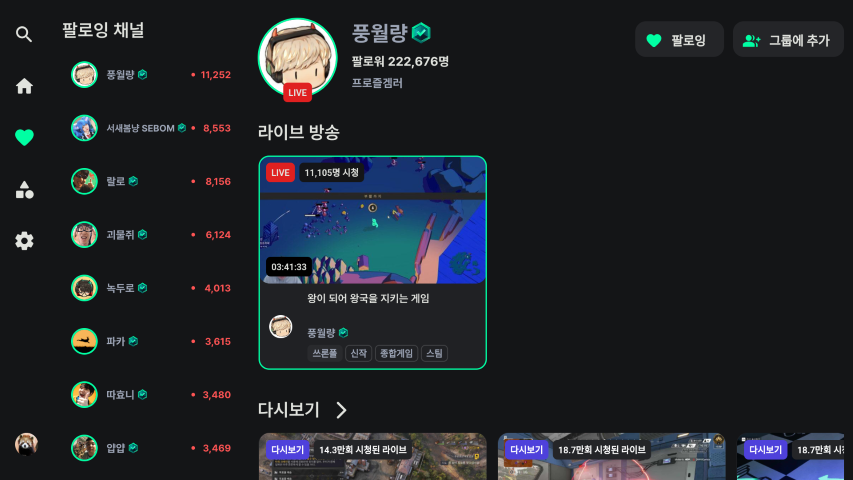
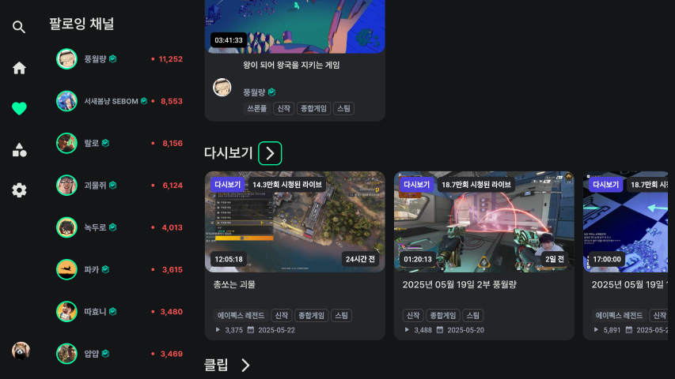

# 채널 소개
검색 결과 또는 팔로잉 채널 목록에서 채널을 선택하여 채널 정보를 확인할 수 있습니다.

- [채널 소개](#채널-소개)
    - [팔로우](#팔로우)
    - [그룹](#그룹)
    - [라이브 방송](#라이브-방송)
    - [동영상](#동영상)
    - [클립](#클립)

# 채널 기능
팔로우/언팔로우, 그룹에 채널 추가, 라이브 방송 보기, 동영상 보기, 클립 보기 기능을 사용할 수 있습니다.

    
    

## 팔로우
상단의 팔로잉 버튼을 눌러 팔로우/언팔로우 합니다.

## 그룹
그룹에 추가 버튼을 눌러 원하는 그룹에 추가할 수 있습니다.

## 라이브 방송
해당 채널의 스트리머가 방송을 하고 있다면 라이브 방송이 보입니다.

## 동영상
채널 정보에서 다시보기를 최신순으로 볼 수 있습니다. 다시보기 옆의 '>' 버튼을 눌러 해당 채널의 전체 영상을 인기순, 최신순으로 볼 수 있습니다.

## 클립
해당 채널의 클립을 확인할 수 있습니다.
