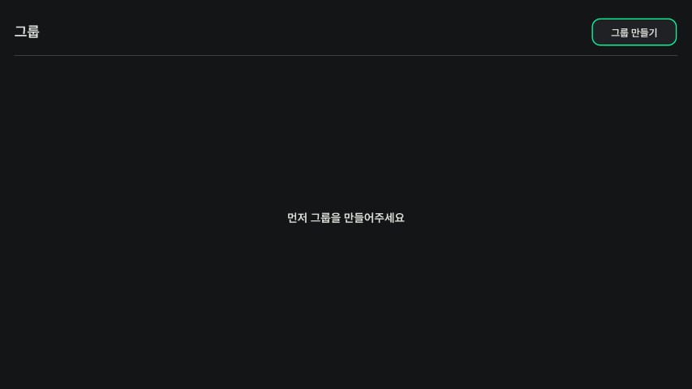
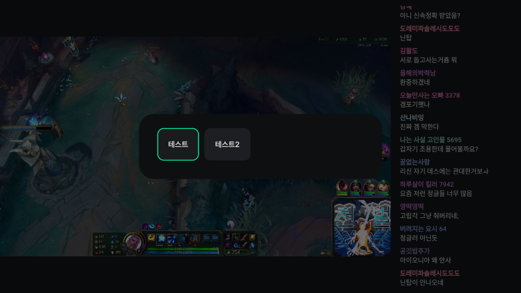
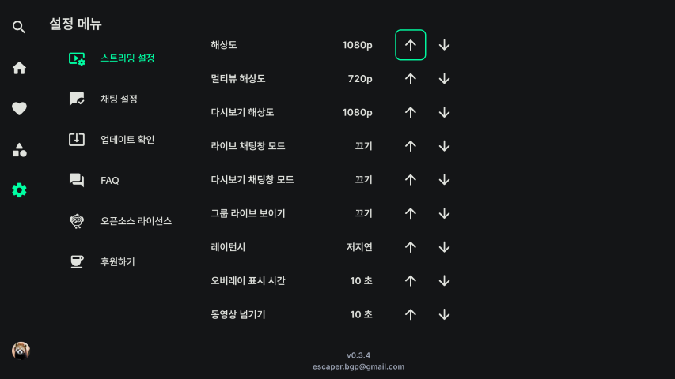
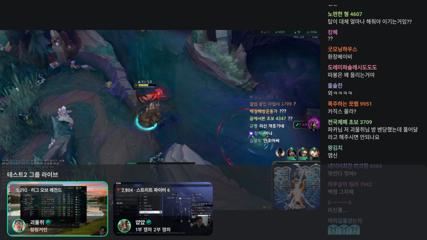

# 그룹
커스텀 그룹을 만들어 원하는 스트리머들을 그룹으로 묶어 한 번에 볼 수 있습니다.

그룹 화면뿐만 아니라, 스트리밍 설정을 통해 라이브 화면에서도 그룹 라이브를 확인할 수 있습니다.

- [그룹 기능](#그룹-기능)
    - [그룹 만들기](#그룹-만들기)
    - [그룹 삭제](#그룹-삭제)
    - [그룹에 추가](#그룹에-추가)
    - [그룹 탈퇴](#그룹-탈퇴)
    - [그룹 라이브](#그룹-라이브)

# 그룹 기능

## 그룹 만들기

    
    

그룹 화면 상단의 그룹 만들기를 누르고, 그룹 이름을 입력해 새로운 그룹을 만듭니다.

## 그룹 삭제
좌측 목록에서 그룹을 선택한 후 우측의 그룹 삭제 아이콘을 눌러 삭제합니다.

## 그룹에 추가

    
    
    
    
    
    

1. 좌측 그룹 목록에서 그룹을 선택합니다
2. 검색 창에서 채널을 검색합니다. (라이브 스트리밍 화면에서도 추가할 수 있습니다.)
3. 채널 정보 상단에서 그룹에 추가를 눌러 그룹을 선택합니다.
4. 추가에 성공하면 화면 하단에 메시지가 나옵니다. 

## 그룹 탈퇴

    
    

그룹에서 삭제를 원하는 채널을 선택하면 팝업 메시지가 뜨고, 탈퇴 버튼을 누르면 해당 그룹에서 탈퇴시킬 수 있습니다.

## 그룹 라이브

    
    
    

[설정 - 스트리밍 설정]에서 그룹 라이브 보이기를 켜짐으로 하거나, [라이브 스트리밍 - 그룹설정]에서 그룹 라이브를 켜짐으로 설정하면

라이브 스트리밍 탐색 시 그룹 목록이 보이게 됩니다.

[라이브 스트리밍 - 그룹설정]에서 활성화할 그룹을 선택할 수 있습니다.