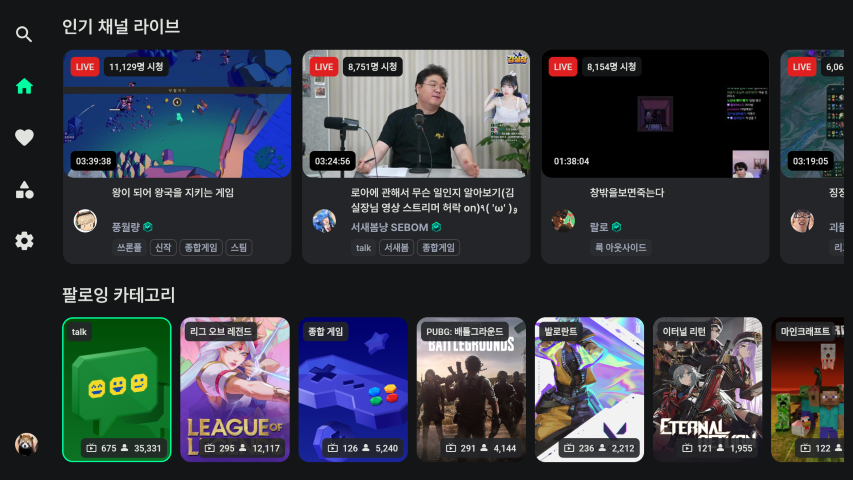
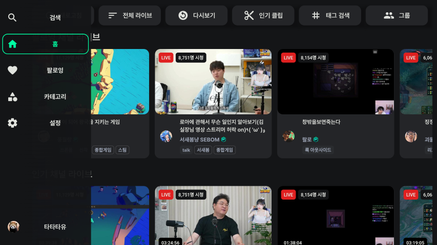

# 홈 화면

    

홈 화면과 기본 조작법 등에 대해 소개합니다.

- [기본 조작법](#기본-조작법)
- [컨텐츠](#컨텐츠)
- [사이드바](#사이드바)
    - [활성화](#활성화)
    - [메뉴](#메뉴)
    - [앱 종료](#앱-종료)
- [최상단 기능](#최상단-기능)

# 기본 조작법
- :arrow_up::arrow_down::arrow_left::arrow_right:: 포커스 이동
- :leftwards_arrow_with_hook:: 사이드바 열기
- 사이드바 메뉴 활성화 상태에서 :leftwards_arrow_with_hook:: 앱 종료

# 컨텐츠

    
    

팔로잉 채널 라이브, 인기 채널 라이브, 팔로잉 카테고리를 볼 수 있습니다.

> [!NOTE]
> 팔로잉 컨텐츠는 로그인 후 사용할 수 있습니다.

# 사이드바

    

## 활성화
홈 화면에서 :leftwards_arrow_with_hook:버튼을 누르거나 :arrow_left:버튼을 계속 눌러 포커스를 이동시키면 활성화됩니다. 

## 메뉴
검색, 홈, 팔로잉, 카테고리, 설정, 로그인 메뉴가 있습니다.

## 앱 종료
사이드바 메뉴가 활성화된 상태에서 :leftwards_arrow_with_hook:버튼을 누르면 하단에 종료 메시지가 뜨게 되고, 메시지가 사라지기 전에 다시 한 번 :leftwards_arrow_with_hook:버튼을 누르면 앱이 종료됩니다.

## 최상단 기능
새로고침 버튼으로 라이브 목록을 갱신할 수 있습니다.

전체 라이브, 전체 다시보기, 인기 클립, 태그 검색, 그룹 메뉴가 있습니다.