# 라이브 방송
라이브 방송 조작법에 대해 설명합니다.

- [싱글뷰](#싱글뷰)
    - [싱글뷰 기본 조작법](#싱글뷰-기본-조작법)
    - [싱글뷰 컨트롤러](#싱글뷰-컨트롤러)
        - [일시정지, 재생, 실시간](#일시정지-재생-실시간)
        - [채팅](#채팅)
        - [화면크기](#화면크기)
        - [채팅설정](#채팅설정)
            - [간편위치](#간편위치)
            - [채팅값 세부 설정](#채팅값-세부-설정)
            - [배지컬렉터](#배지컬렉터)
        - [소리설정](#소리설정)
        - [화질설정](#화질설정)
        - [멀티뷰 전환](#멀티뷰-전환)
    - [라이브 탐색](#라이브-탐색)
    - [오버레이 채팅](#오버레이-채팅)

- [멀티뷰](#멀티뷰)
    - [멀티뷰 기본 조작법](#멀티뷰-기본-조작법)
    - [멀티뷰 컨트롤러](#멀티뷰-컨트롤러)
        - [멀티뷰 화면설정](#멀티뷰-화면설정)
        - [방송끄기](#방송끄기)
        - [재생정보](#재생정보)
        - [싱글뷰 전환](#싱글뷰-전환)
    - [라이브 추가](#라이브-추가)
    - [활성화](#활성화)
    - [크게보기](#크게보기)
- [라이브 종료](#라이브-종료)

# 싱글뷰
라이브를 재생합니다. 기본 화질과 지연 모드는 스트리밍 [설정](USAGE_SETTINGS.md)의 **해상도**와 **레이턴시**가 적용됩니다.

## 싱글뷰 기본 조작법
- :ok:: [컨트롤러](#싱글뷰-컨트롤러) 보기
- :arrow_up:: [라이브 탐색](#라이브-탐색)
- :arrow_down:: [오버레이 채팅](#오버레이-채팅) on/off
- :arrow_left::arrow_right:: 오버레이 채팅 [간편 이동](#간편위치)
- :leftwards_arrow_with_hook: * 2: [라이브 종료](#라이브-종료)

## 싱글뷰 컨트롤러

    

:ok: 버튼을 눌러서 기본 컨트롤러를 사용할 수 있습니다. 좌측 상단에 현재 라이브 상태가 함께 표시됩니다.

### 일시정지, 재생, 실시간
영상을 일시정지 할 수 있으며 45초 이내에 재생 버튼을 누르면 일시정지한 시점에서 다시 재생하게 됩니다.
만약 45초가 지난 후 다시 재생하면 실시간 화면으로 재생됩니다. 

실시간 버튼을 누르면 실시간 화면으로 다시 재생됩니다.

### 채팅

    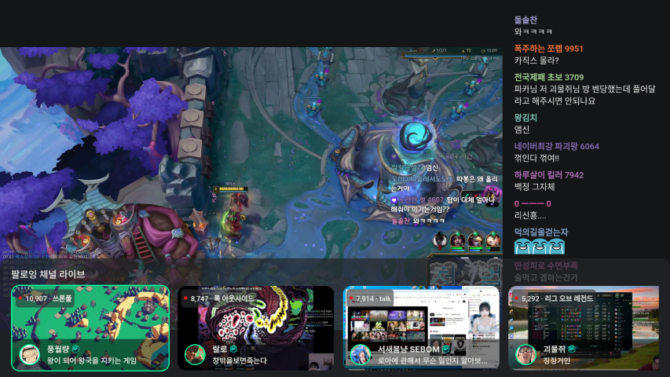
    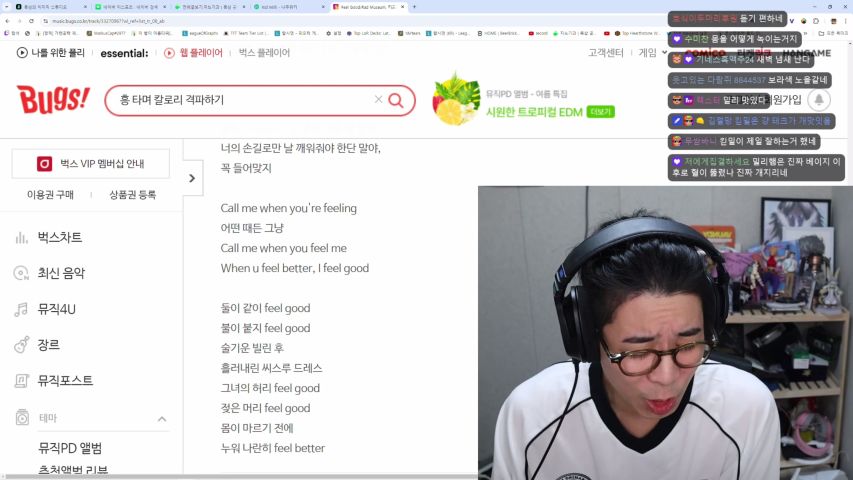

오버레이 채팅을 ON | OFF 합니다.

### 화면크기

    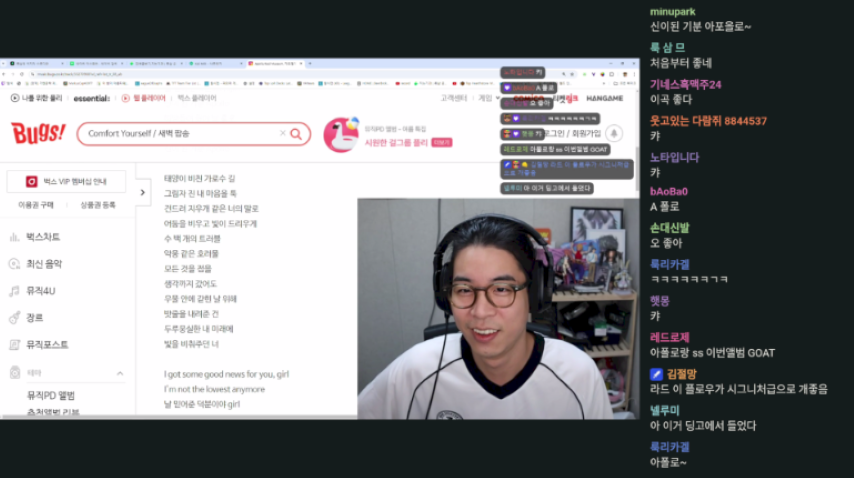

화면 좌측에 사이드 채팅을 ON | OFF 합니다.

### 채팅설정

    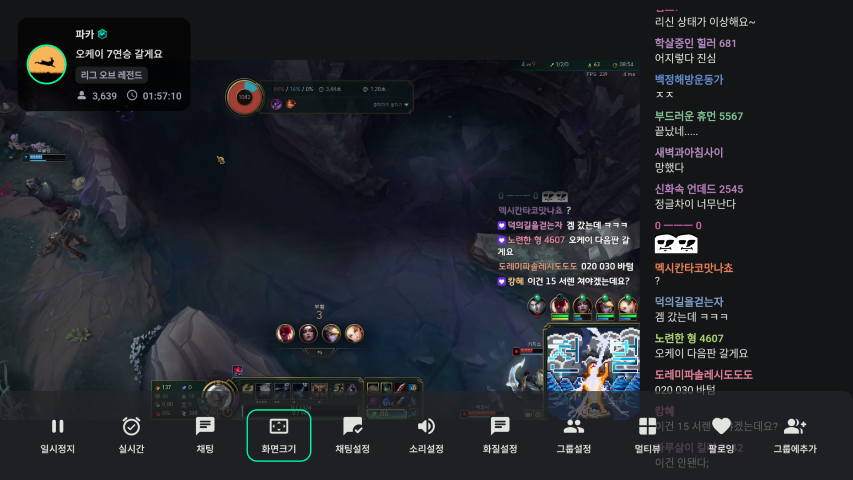

채팅 세부 설정을 할 수 있습니다. :arrow_left::arrow_right: 버튼으로 포커스를 이동하고  :arrow_up::arrow_down: 버튼으로 값을 조정합니다.

#### 간편위치
오버레이 채팅 위치를 간단하게 조정할 수 있습니다.

#### 채팅값 세부 설정
위치, 높이, 너비, 글씨크기, 투명도 등을 세부적으로 조정할 수 있습니다.

#### 배지컬렉터

    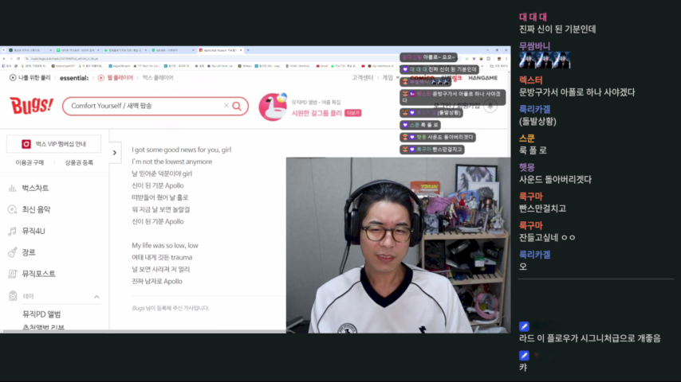

배지컬렉터를 켜짐으로 설정하면 배지를 단 유저의 채팅을 따로 모아서 보여줍니다. 배지컬렉터의 높이도 설정할 수 있으며 오버레이 채팅에도 똑같이 적용됩니다.

### 소리설정

    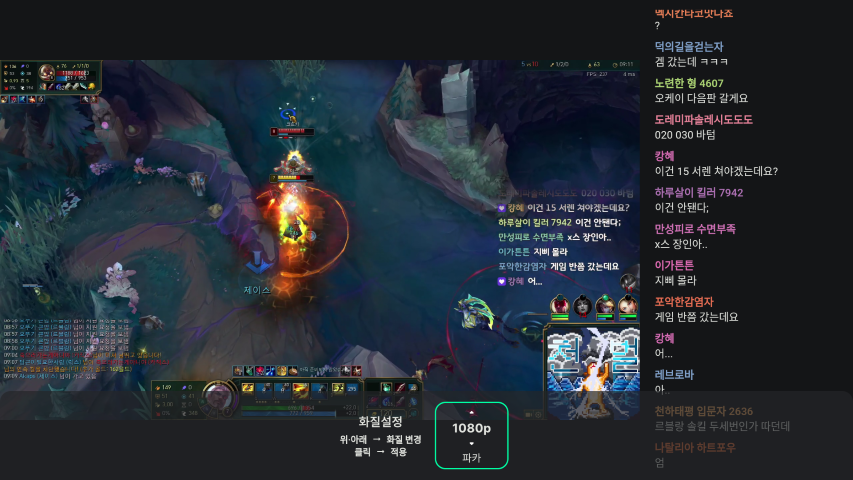

소리 세부 설정을 할 수 있습니다. :arrow_up::arrow_down:버튼으로 값을 조정하고 :ok:버튼으로 음소거 on | off 상태를 변경합니다. 멀티뷰에서도 똑같이 적용됩니다.

### 화질설정

    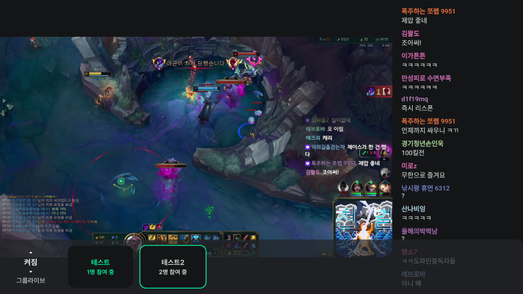

화질 세부 설정을 할 수 있습니다. :arrow_up::arrow_down:버튼으로 값을 조정하고 :ok:버튼으로 적용합니다. 상태를 변경합니다. 멀티뷰에서도 똑같이 적용됩니다.

### 멀티뷰 전환

    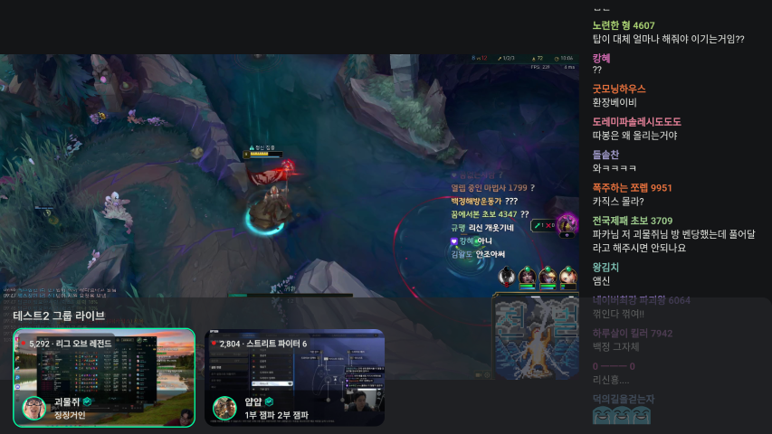

화면 모드를 멀티뷰로 전환합니다.

## 라이브 탐색

    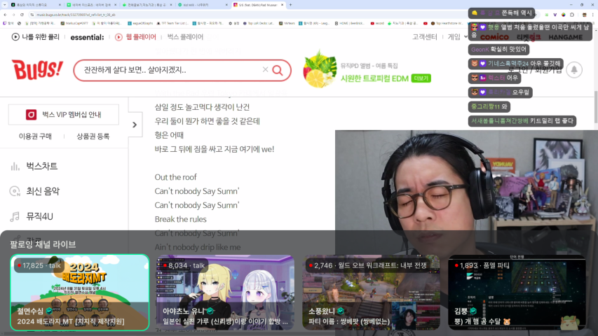

:arrow_up: 버튼을 눌러 탐색합니다. 

이 상태에서 :arrow_up::arrow_down: 버튼을 누르면 팔로잉 채널 라이브, 카테고리 채널 라이브, 인기 채널 라이브를 순회하며 탐색합니다.

:arrow_left::arrow_right: 버튼으로 라이브 채널을 선택하고 :ok: 버튼으로 방송을 변경합니다.

## 오버레이 채팅

    
    
    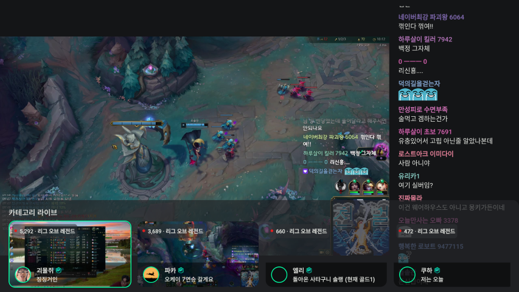

:arrow_down: 버튼으로 오버레이 채팅을 ON | OFF 합니다.

:arrow_left::arrow_right: 버튼으로 오버레이 채팅 위치를 바꿉니다. (채팅 설정 - 간편 위치가 적용됩니다)

# 멀티뷰
여러 개의 화면을 동시에 재생합니다. 기본 화질과 지연 모드는 스트리밍 [설정](USAGE_SETTINGS.md)의 **멀티뷰 해상도**와 **레이턴시**가 적용됩니다.

## 멀티뷰 기본 조작법
- :ok:: 컨트롤러 보기
- :arrow_up:: 라이브 탐색
- :arrow_down:: 크게보기 | 모아보기
- :arrow_left::arrow_right:: 활성화 채널 변경
- :leftwards_arrow_with_hook: * 2: 라이브 종료

## 멀티뷰 컨트롤러

    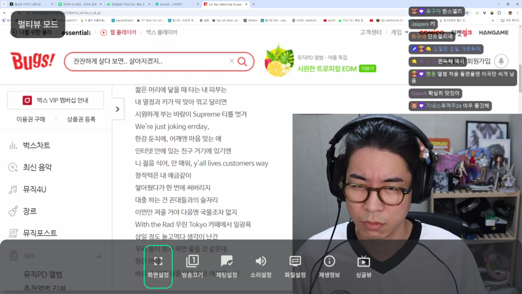

:ok: 버튼을 눌러서 멀티뷰 컨트롤러를 사용할 수 있습니다. 좌측 상단에 **멀티뷰 모드**가 함께 표시됩니다.

### 멀티뷰 화면설정
화면 설정 옵션에서 크게보기 | 모아보기 상태를 설정할 수 있습니다.

### 방송끄기

    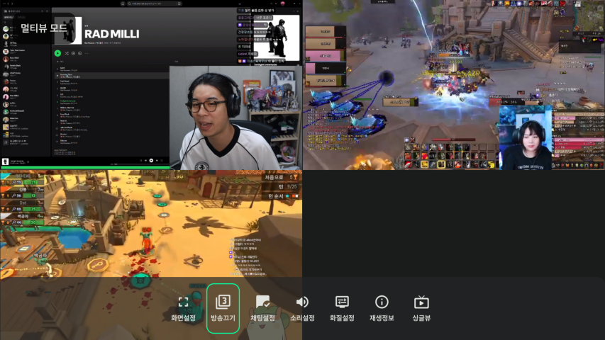

마지막으로 추가한 방송을 멀티뷰 목록에서 제외합니다.

### 재생정보

    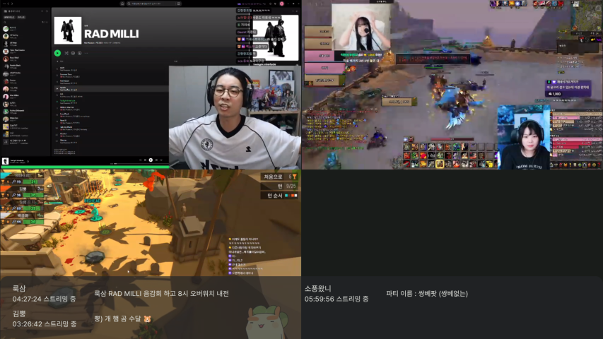

현재 재생 중인 방송들의 간단 정보를 표시합니다.

### 싱글뷰 전환

    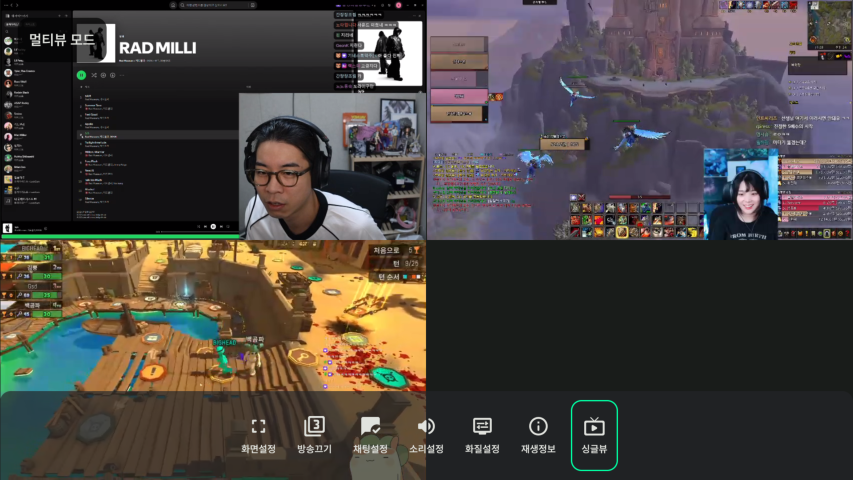

싱글뷰 모드로 전환합니다. 활성화된 방송이 싱글뷰 모드로 전환됩니다. 

## 라이브 추가

    
    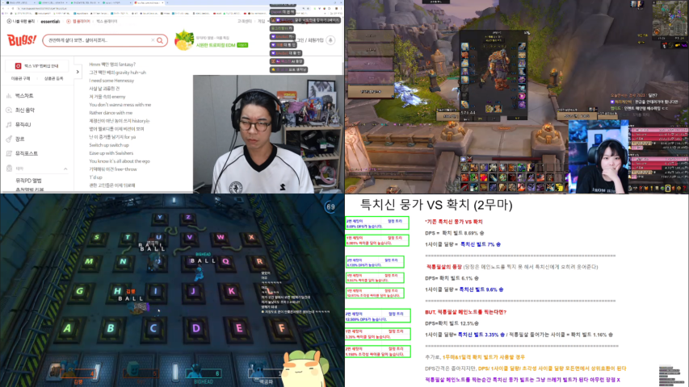

멀티뷰 모드로 전환한 상태에서 :arrow_up: 버튼을 눌러 라이브 탐색창을 열고 추가할 라이브를 :ok: 버튼을 눌러 선택합니다.
최대 4개 까지 추가할 수 있습니다. 

## 활성화 

    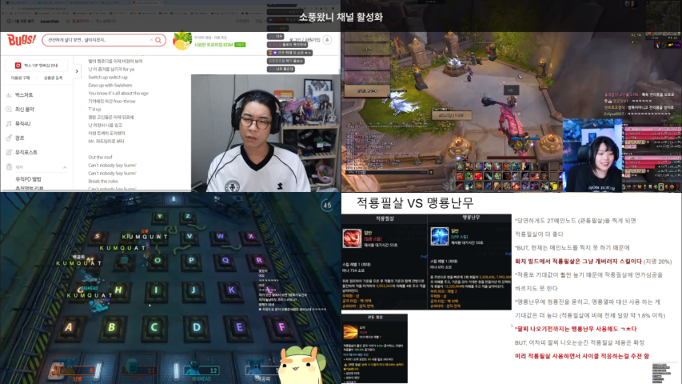

모아보기 화면에서 :arrow_left::arrow_right: 버튼을 눌러 소리를 활성화할 채널을 선택할 수 있습니다.

    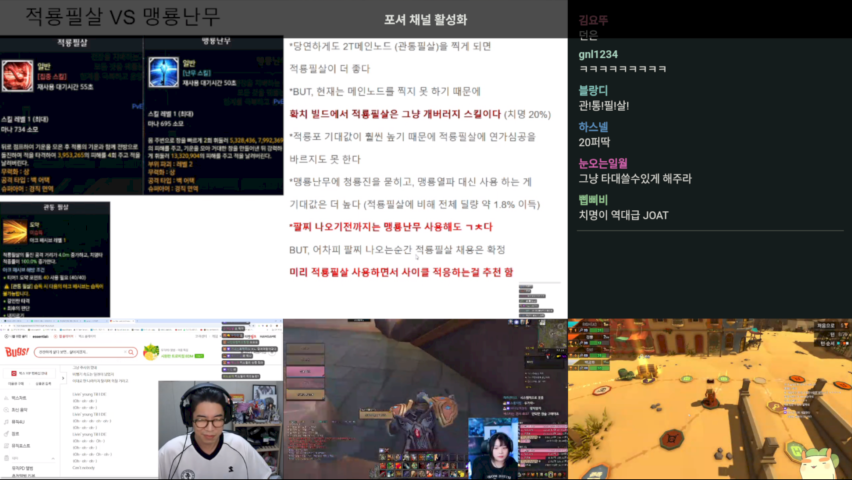

크게보기 화면에서 :arrow_left::arrow_right: 버튼을 눌러 소리와 화면을 활성화할 채널을 선택할 수 있습니다.

## 크게보기 | 모아보기

    

모아보기 화면에서 :arrow_down: 버튼을 눌러 크게보기 화면으로 전환할 수 있습니다. 반대도 적용됩니다.

# 라이브 종료

    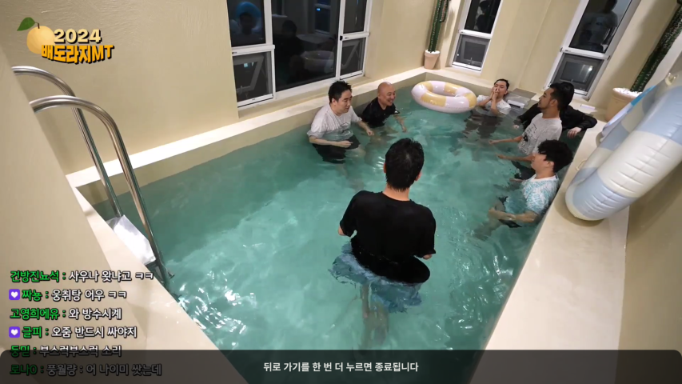

:leftwards_arrow_with_hook: 버튼을 누르면 종료 안내 메시지가 나타나고 메시지가 사라지기 전에 다시 한 번  :leftwards_arrow_with_hook: 버튼을 누르면 라이브 화면에서 나가게 됩니다.