# 라이브 방송
라이브 방송 조작법에 대해 설명합니다.

- [싱글뷰](#싱글뷰)
    - [싱글뷰 기본 조작법](#싱글뷰-기본-조작법)
    - [싱글뷰 설정 메뉴](#싱글뷰-설정-메뉴)
        - [일시정지, 재생, 실시간](#일시정지-재생-실시간)
        - [채팅](#채팅)
        - [화면크기](#화면크기)
        - [채팅설정](#채팅설정)
        - [소리설정](#소리설정)
        - [화질설정](#화질설정)
        - [그룹설정](#그룹설정)
        - [멀티뷰 전환](#멀티뷰-전환)
    - [라이브 탐색](#라이브-탐색)
    - [화면에 채팅 띄우기](#화면에-채팅-띄우기)

- [멀티뷰](#멀티뷰)
    - [멀티뷰 기본 조작법](#멀티뷰-기본-조작법)
    - [멀티뷰 설정 메뉴](#멀티뷰-설정-메뉴)
        - [멀티뷰 화면설정](#멀티뷰-화면설정)
        - [멀티뷰 방송끄기](#멀티뷰-방송끄기)
        - [멀티뷰 기본 설정](#멀티뷰-기본본-설정)
        - [멀티뷰 재생정보](#멀티뷰-재생정보)
        - [싱글뷰 전환](#싱글뷰-전환)
    - [라이브 추가](#라이브-추가)
    - [채널 활성화](#채널-활성화)
    - [크게보기](#크게보기)
- [라이브 종료](#라이브-종료)

# 싱글뷰
한 개의 라이브 방송을 재생합니다. 기본 화질과 지연 모드는 스트리밍 [설정](USAGE_SETTING.md)의 **해상도**와 **레이턴시**가 적용됩니다.

## 싱글뷰 기본 조작법
- :ok:: [컨트롤러](#싱글뷰-컨트롤러) 보기
- :arrow_up:: [라이브 탐색](#라이브-탐색)
- :arrow_down:: [오버레이 채팅](#오버레이-채팅) on/off
- :arrow_left::arrow_right:: 오버레이 채팅 [간편 이동](#간편위치)
- :leftwards_arrow_with_hook: * 2: [라이브 종료](#라이브-종료)

## 싱글뷰 설정 메뉴

    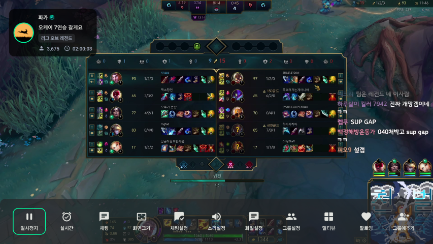

:ok: 버튼을 눌러서 기본 컨트롤러를 사용할 수 있습니다. 좌측 상단에 현재 라이브 상태가 함께 표시됩니다.

### 일시정지, 재생, 실시간
영상을 일시정지 할 수 있으며 45초 이내에 재생 버튼을 누르면 일시정지한 시점에서 다시 재생하게 됩니다.
만약 45초가 지난 후 다시 재생하면 실시간 화면으로 재생됩니다. 

실시간 버튼을 누르면 실시간 화면으로 다시 재생됩니다.

### 채팅
화면에 채팅을 띄웁니다.

### 화면크기

    

화면 크기를 조절하여 우측에 채팅창을 보여주거나 전체 화면으로 돌아옵니다.

### 채팅설정

    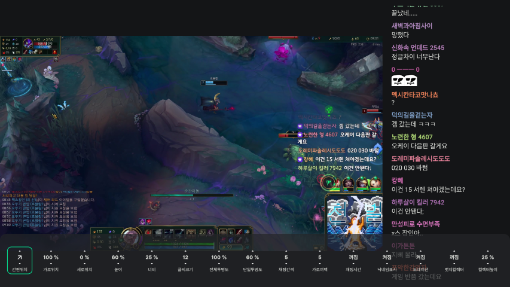

채팅 세부 설정을 할 수 있습니다. :arrow_left::arrow_right: 버튼으로 포커스를 이동하고  :arrow_up::arrow_down: 버튼으로 값을 조정합니다.

#### 간편 위치
오버레이 채팅 위치를 간단하게 조정할 수 있습니다. 라이브 화면에서 :arrow_left::arrow_right: 버튼으로도 간편 위치 조작을 할 수 있습니다.

#### 채팅값 세부 설정
위치, 높이, 너비, 글씨 크기, 투명도 등을 세부적으로 조정할 수 있습니다.

#### 뱃지 컬렉터
뱃지 컬렉터를 켜짐으로 설정하면 뱃지를 단 유저(스트리머, 매니저 등)의 채팅을 따로 모아서 보여줍니다. 뱃지컬렉터의 높이도 설정할 수 있으며 오버레이 채팅에도 똑같이 적용됩니다.

### 소리설정

    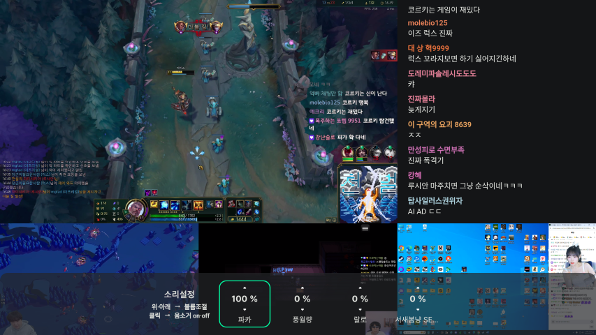

소리 세부 설정을 할 수 있습니다. :arrow_up::arrow_down:버튼으로 값을 조정하고 :ok:버튼으로 음소거 on | off 상태를 변경합니다. 멀티뷰에서도 똑같이 적용됩니다.

### 화질설정

    

화질 세부 설정을 할 수 있습니다. :arrow_up::arrow_down:버튼으로 값을 조정하고 :ok:버튼으로 적용합니다. 상태를 변경합니다. 멀티뷰에서도 똑같이 적용됩니다.

### 그룹설정

    

그룹라이브를 켜짐으로 설정하면 라이브 탐색 시 그룹 라이브가 나타납니다. 나타나는 그룹은 그룹설정에서 선택할 수 있습니다.

### 멀티뷰 전환

    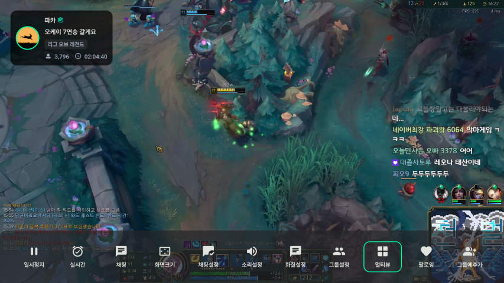

라이브를 중단하지 않고 멀티뷰 모드로 전환합니다.

## 라이브 탐색

    
    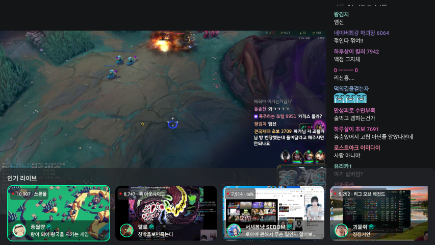
    
    

:arrow_up: 버튼을 눌러 탐색합니다. 

탐색 창이 활성화 된 상태에서 :arrow_up::arrow_down: 버튼을 누르면 팔로잉 채널 라이브, 카테고리 채널 라이브, 인기 채널 라이브를 순회하며 탐색합니다.

그룹 보이기 설정이 켜져있으면 그룹 라이브를 가장 먼저 보여줍니다.

:arrow_left::arrow_right: 버튼으로 라이브 채널을 선택하고 :ok: 버튼으로 방송을 변경합니다.

## 화면에 채팅 띄우기

:arrow_down: 버튼으로 오버레이 채팅을 ON | OFF 합니다.

:arrow_left::arrow_right: 버튼으로 오버레이 채팅 위치를 바꿉니다. (채팅 설정 - 간편 위치가 적용됩니다)

# 멀티뷰
여러 개의 화면을 동시에 재생합니다. 기본 화질과 지연 모드는 스트리밍 [설정](USAGE_SETTINGS.md)의 **멀티뷰 해상도**와 **레이턴시**가 적용됩니다.

## 멀티뷰 기본 조작법
- :ok:: 컨트롤러 보기
- :arrow_up:: 라이브 탐색
- :arrow_down:: 크게보기 | 모아보기
- :arrow_left::arrow_right:: 활성화 채널 변경
- :leftwards_arrow_with_hook: * 2: 라이브 종료

## 멀티뷰 설정 메뉴

    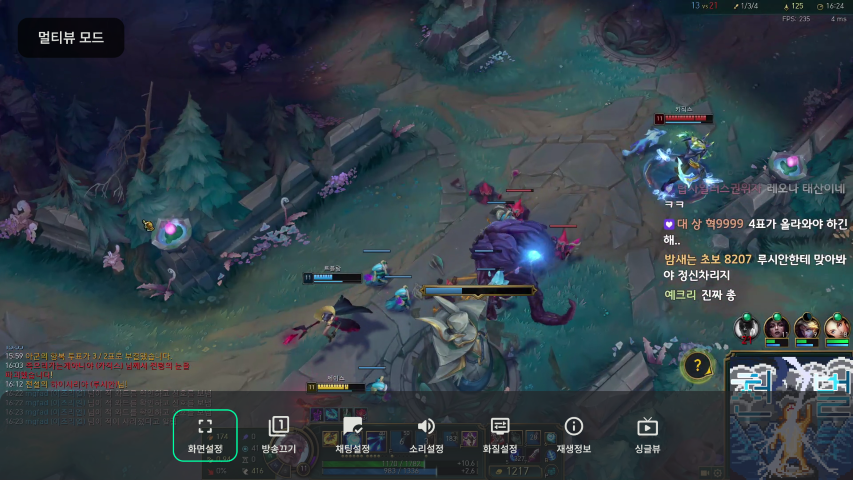

:ok: 버튼을 눌러서 멀티뷰 컨트롤러를 사용할 수 있습니다. 좌측 상단에 **멀티뷰 모드**가 함께 표시됩니다.

### 멀티뷰 화면설정

     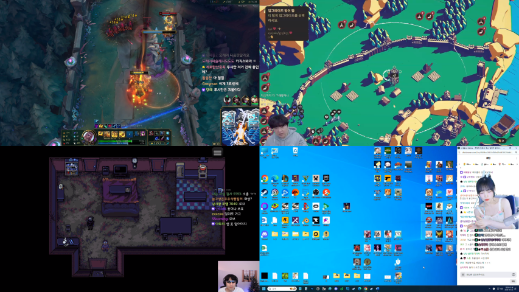
     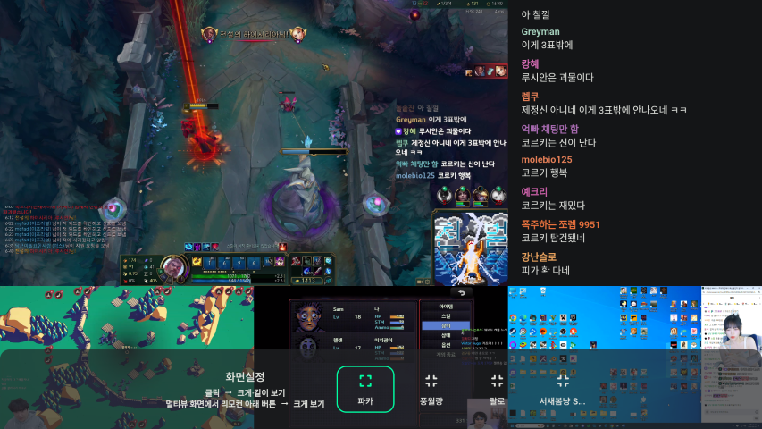

화면설정 옵션에서 크게보기 | 모아보기 상태를 설정할 수 있습니다. 크게보기로 선택한 채널은 우측에 채팅을 함께 보여줍니다.

전체 화면에서 :arrow_down: 버튼을 눌러서도 크게보기 | 모아보기를 상태를 설정할 수 있습니다. 

### 멀티뷰 방송끄기

    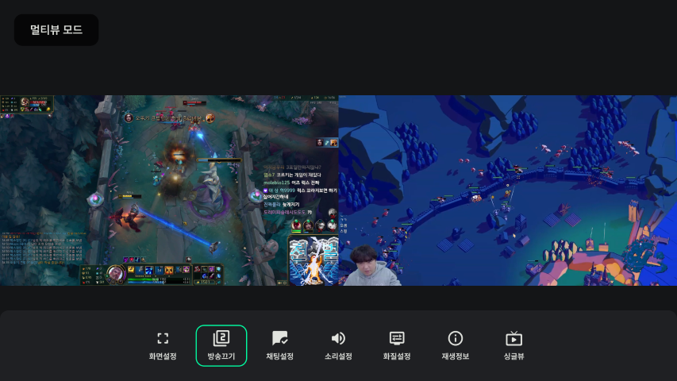

마지막으로 추가한 방송부터 멀티뷰 목록에서 제외합니다.

### 멀티뷰 기본 설정

     
     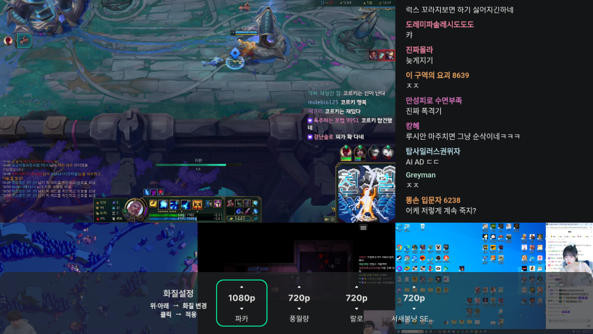

싱글뷰 설정과 동일합니다.

### 멀티뷰 재생정보

    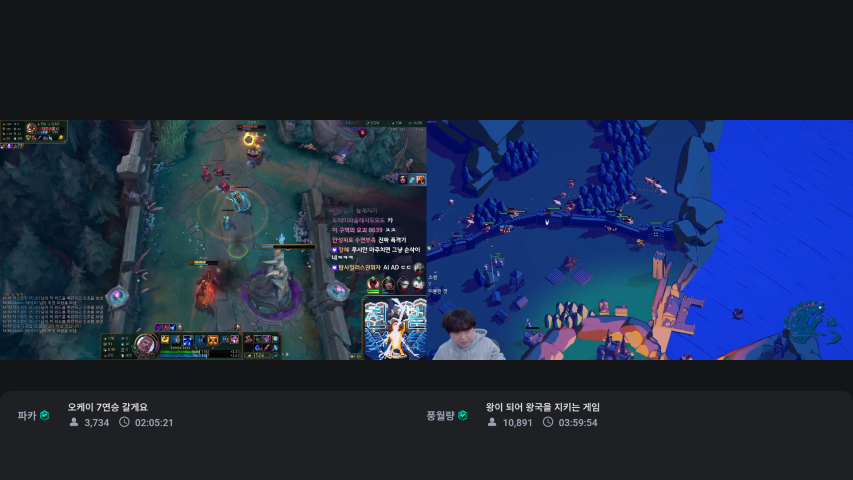

간단한 재생 정보를 보여줍니다.

### 싱글뷰 전환

    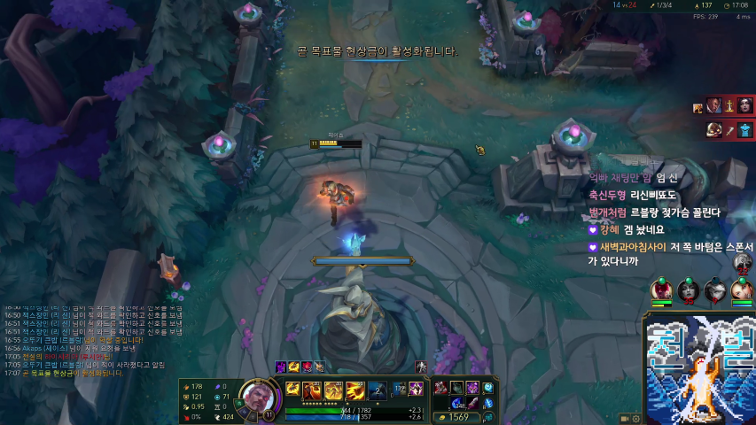

싱글뷰 모드로 전환합니다. 활성화된 방송만 남기고 나머지 방송은 종료됩니다.

## 라이브 추가

    

멀티뷰 모드로 전환한 상태에서 :arrow_up: 버튼을 눌러 라이브 탐색창을 열고 추가할 라이브를 :ok: 버튼을 눌러 선택합니다.
최대 4개 까지 추가할 수 있습니다. 

## 채널 활성화
모아보기 화면에서 :arrow_left::arrow_right: 버튼을 눌러 소리를 활성화할 채널을 선택할 수 있습니다.

크게보기 화면에서 :arrow_left::arrow_right: 버튼을 눌러 소리와 화면을 활성화할 채널을 선택할 수 있습니다.

## 크게보기
모아보기 화면에서 :arrow_down: 버튼을 눌러 크게보기 화면으로 전환할 수 있습니다. 반대도 적용됩니다.

# 라이브 종료
:leftwards_arrow_with_hook: 버튼을 누르면 종료 안내 메시지가 나타나고 메시지가 사라지기 전에 다시 한 번  :leftwards_arrow_with_hook: 버튼을 누르면 라이브 화면에서 나가게 됩니다.