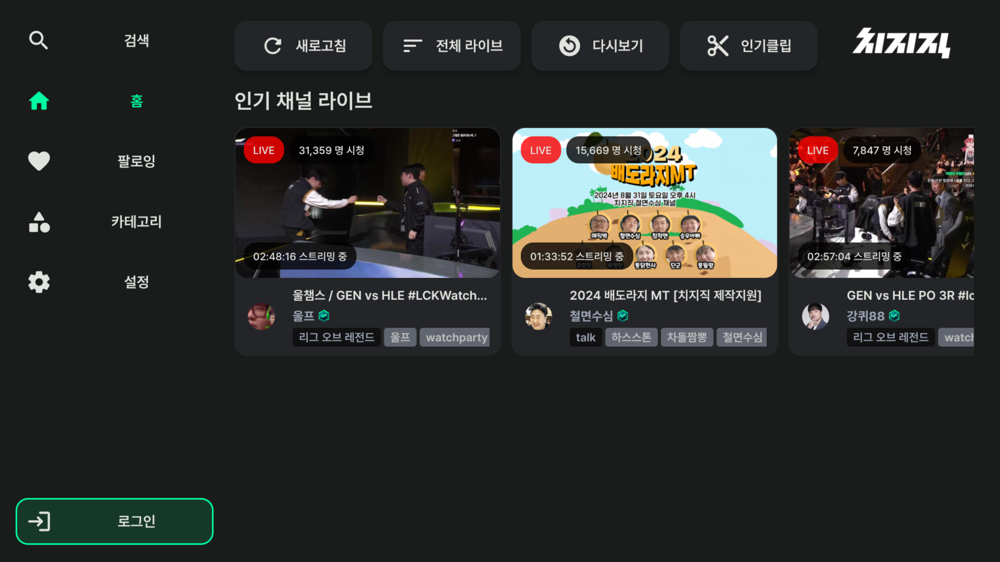
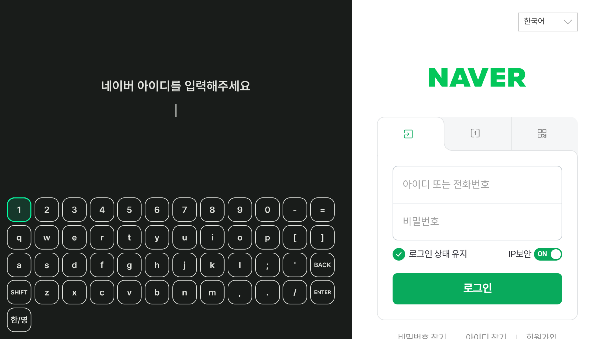
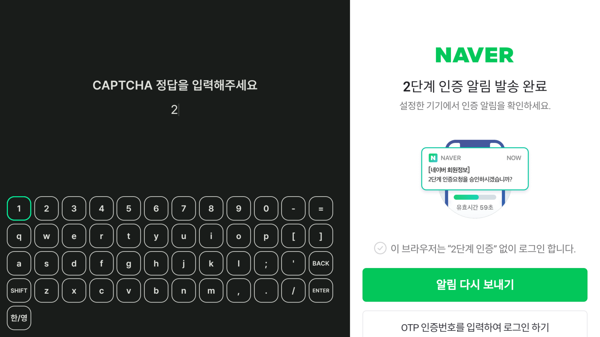
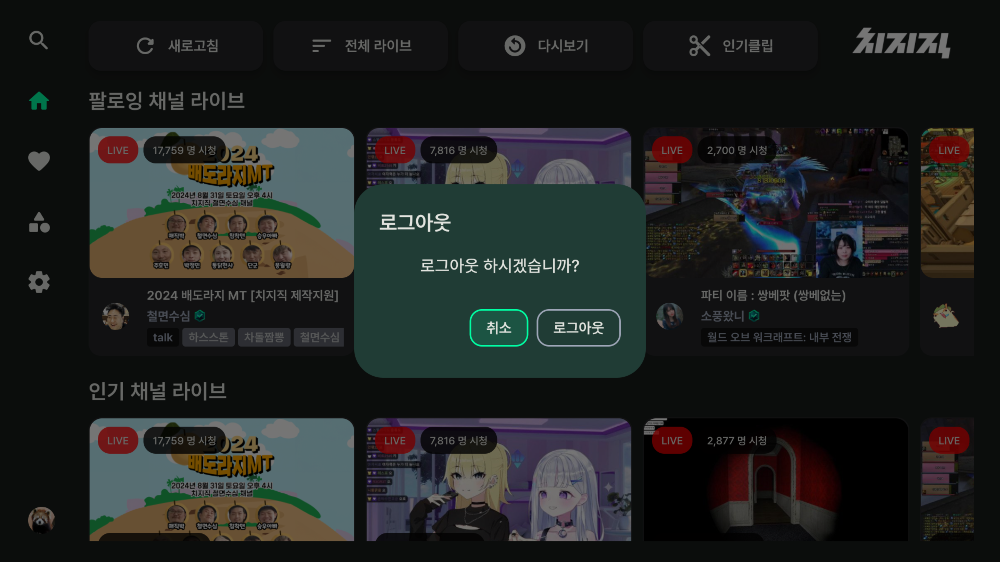

# 로그인
로그인 | 로그아웃 방법에 대해 소개합니다.

- [로그인](#로그인)
- [로그아웃](#로그아웃)

# 로그인

1. 홈 화면에서 :leftwards_arrow_with_hook: 버튼을 눌러 사이드바 메뉴룰 활성화하고 로그인 버튼을 누릅니다. 

    

2. 아이디 비밀번호를 입력하고 엔터 버튼을 누릅니다. 2단계 인증이 설정되어 있는 경우 모바일 알림을 확인하여 2단계 인증을 진행합니다. (로그인에 문제가 있을 경우 CAPTCHA 입력 화면이 나타납니다).

    
    

3. 인증 후 잠시 기다리면 우측 화면에 치지직 홈페이지가 나타나면서 로그인이 완료되고, 홈 화면으로 이동됩니다.

    

# 로그아웃
1. 사이드바 메뉴 최하단의 프로필을 클릭하면 로그아웃 팝업 알림이 뜨게 되고 로그아웃 버튼을 누르면 진행됩니다. 

    

