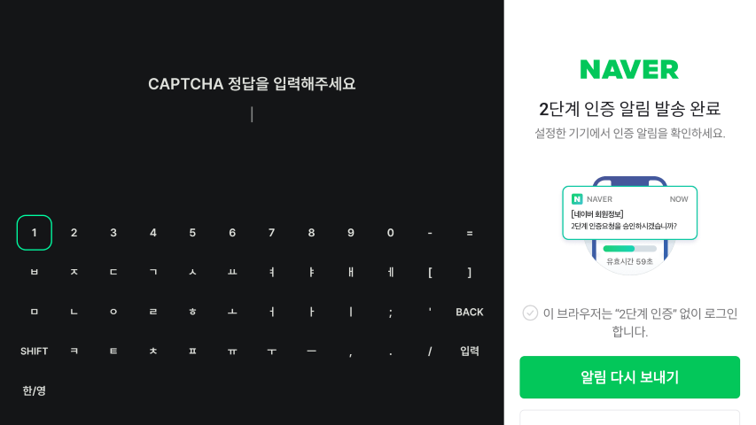
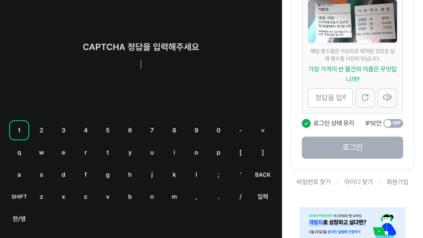
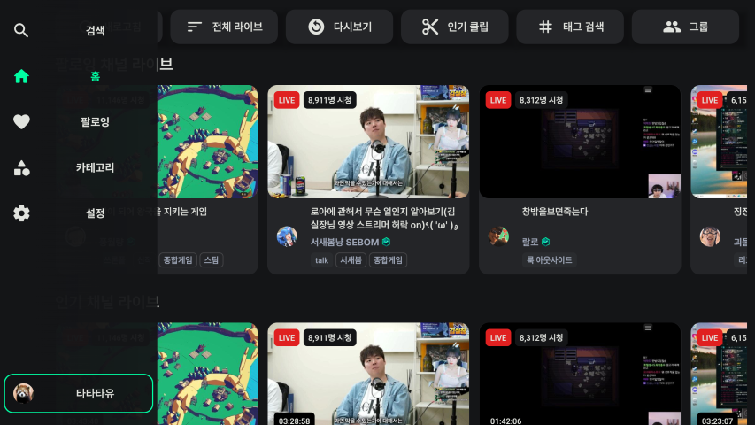
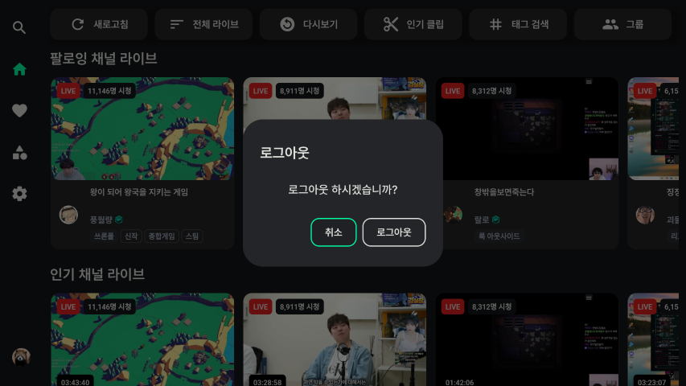

# 로그인 소개
로그인, 로그아웃 방법에 대해 소개합니다.

- [로그인](#로그인)
- [로그아웃](#로그아웃)

# 로그인
1. 홈 화면에서 :leftwards_arrow_with_hook: 버튼을 눌러 사이드바 메뉴룰 활성화하고 로그인 버튼을 누릅니다. 

    

2. 아이디 비밀번호를 입력합니다. 2단계 인증이 설정되어 있는 경우 모바일 알림을 확인하여 2단계 인증을 진행합니다.

    
    

3. 비밀번호를 연속해서 틀리거나, 보안 문제가 발생하면 CAPTCHA 문제가 나옵니다. 정답을 입력합니다.

    

# 로그아웃
1. 홈 화면에서 :leftwards_arrow_with_hook: 버튼을 눌러 사이드바 메뉴룰 활성화하고 프로필을 누릅니다. 

    

2. 로그아웃 팝업에서 로그아웃을 선택합니다.

    

