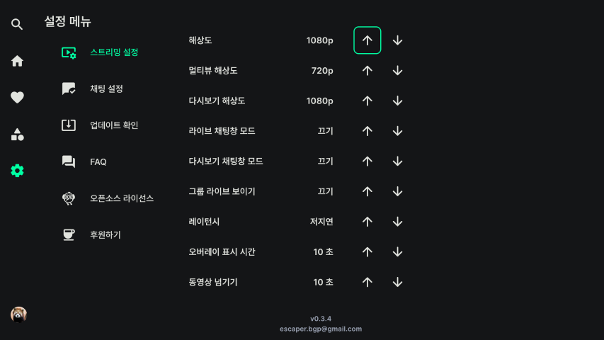
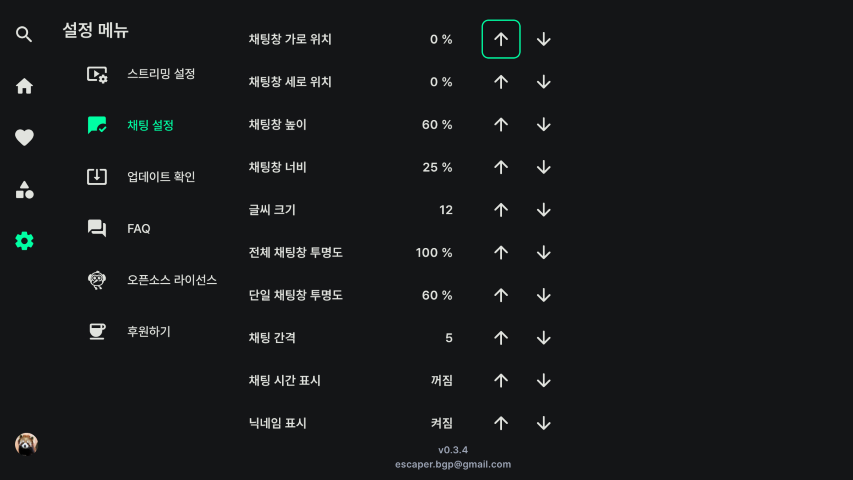

# 설정
사이드바 메뉴에서 설정 메뉴를 선택합니다.

스트리밍 설정, 채팅 설정을 할 수 있습니다. 업데이트도 확인할 수 있습니다.

- [스트리밍 설정](#스트리밍-설정)
- [채팅 설정](#채팅-설정)

## 스트리밍 설정

    

기본 스트리밍 설정입니다.

### 해상도
라이브 스트리밍 해상도를 설정합니다.

### 멀티뷰 해상도
멀티뷰 화면 전환 후 새로 추가되는 라이브의 해상도를 설정합니다. 멀티뷰 화면에서 렉이 심하다면 해상도를 낮춰주세요.

### 다시보기 해상도
다시보기 해상도를 설정합니다

### 라이브 채팅창 모드
라이브 화면 기본 채팅창 모드를 설정합니다.

### 다시보기 채팅창 모드
다시보기 화면 기본 채팅창 모드를 설정합니다.

### 그룹 라이브 보이기
이 설정을 켜면 라이브 탐색 시 그룹 라이브를 보여줍니다.

### 레이턴시
라이브 지연을 설정합니다. 저지연으로 설정하면 딜레이가 더 적습니다.

### 오버레이 표시 시간
라이브 화면 위에 표시되는 설정 창 표시 시간을 설정합니다.

### 동영상 넘기기
다시보기 동영상 넘기는 시간을 설정합니다. 리모컨 좌우 버튼이나, 다시보기 기본 설정 메뉴의 되감기, 빨리감기 버튼에 적용됩니다. (슬라이더에는 적용되지 않습니다.)

## 채팅 설정

    

채팅 설정입니다. 라이브 화면에서도 설정할 수 있습니다.
