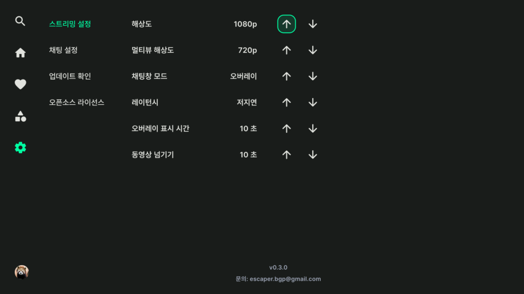
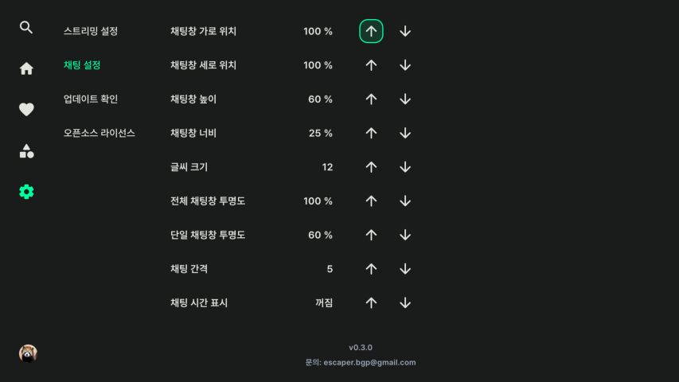

# 설정
사이드바 메뉴에서 설정 버튼을 선택해서 진입합니다.

스트리밍 설정, 채팅 설정을 할 수 있습니다. 업데이트를 확인할 수 있습니다.

## 스트리밍 설정

    

기본 스트리밍 설정입니다.

### 해상도
싱글뷰 해상도를 설정합니다.

### 멀티뷰 해상도
멀티뷰 화면 전환 후 새로 추가되는 라이브의 해상도를 설정합니다. 멀티뷰 화면에서 렉이 심하다면 해상도를 낮춰주세요.

### 채팅창 모드
싱글뷰 기본 채팅창 설정입니다.

### 레이턴시
레이턴시를 선택할 수 있습니다. 저지연모드를 선택하면 딜레이가 더 적습니다(때떄로 화질이 뭉게질 수 있습니다). 

### 오버레이 표시 시간
오버레이창이 나타난 후 사라질 때 까지 시간을 설정합니다.

### 동영상 넘기기
VOD 기본 컨트롤러에서 뒤로감기 | 빨리감기 버튼을 한 번 클릭할 때 넘기기 시간을 설정합니다.

## 채팅 설정

    

채팅 세부 설정입니다. 라이브 화면에서도 설정할 수 있습니다.

