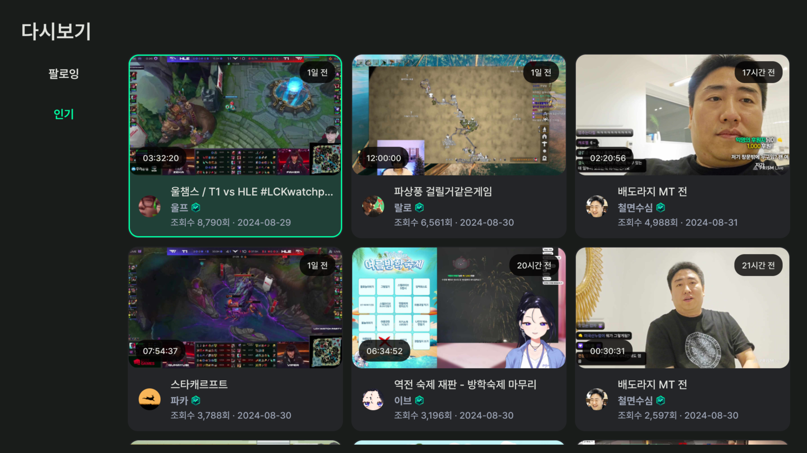
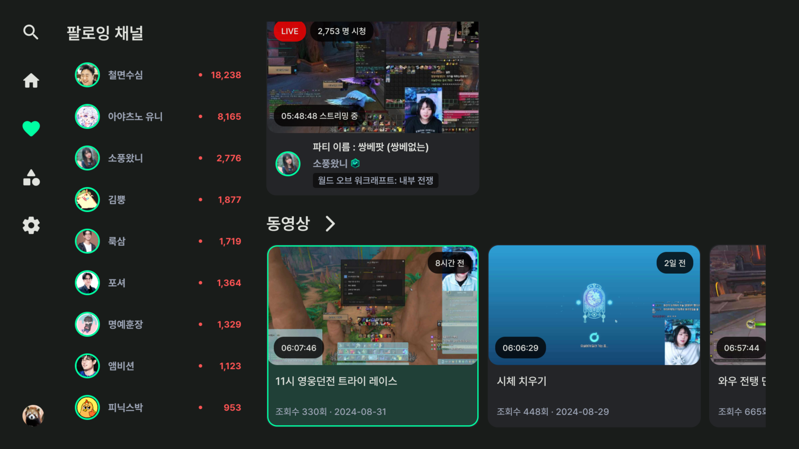
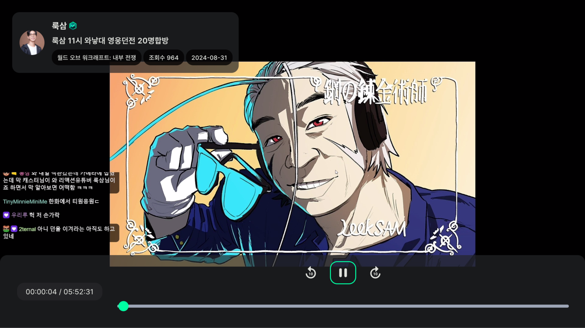
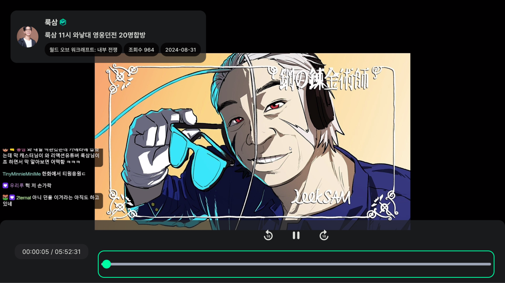

# 다시보기
VOD 다시보기에 대해 설명합니다.

- [다시보기 목록](#다시보기-목록)
- [조작법](#조작법)
    - [기본 컨트롤러](#기본-컨트롤러)
    - [VOD 탐색](#vod-탐색)

# 다시보기 목록

    
    

    
    

다시보기는 홈 화면 상단 다시보기, 카테고리 다시보기, 팔로잉 채널, 검색 채널에서 볼 수 있습니다.

# 조작법
## 기본 컨트롤러

    
    

:ok: 버튼을 눌러 기본 컨트롤러를 사용할 수 있습니다. **[뒤로감기, 빨리감기, 일시정지, 재생] 기능을 사용할 수 있습니다.

스트리밍 [설정](USAGE_SETTINGS.md)에서 **동영상 넘기기** 값을 조정하여 뒤로감기 | 빨리감기 버튼의 넘기기 시간을 조정할 수 있습니다.

## VOD 탐색

    

:arrow_up: 버튼을 눌러 지금 시청하고 있는 VOD 채널의 동영상을 최신순으로 탐색할 수 있습니다.