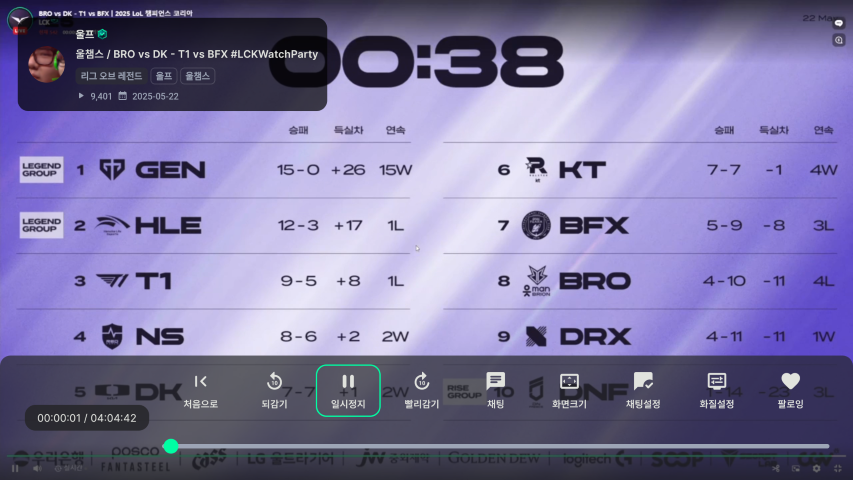
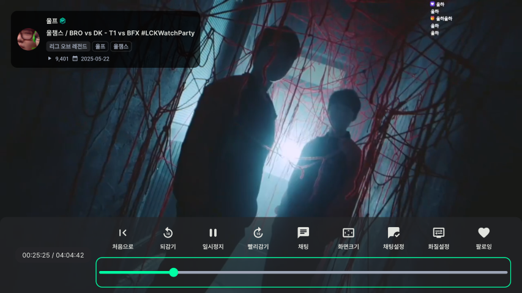
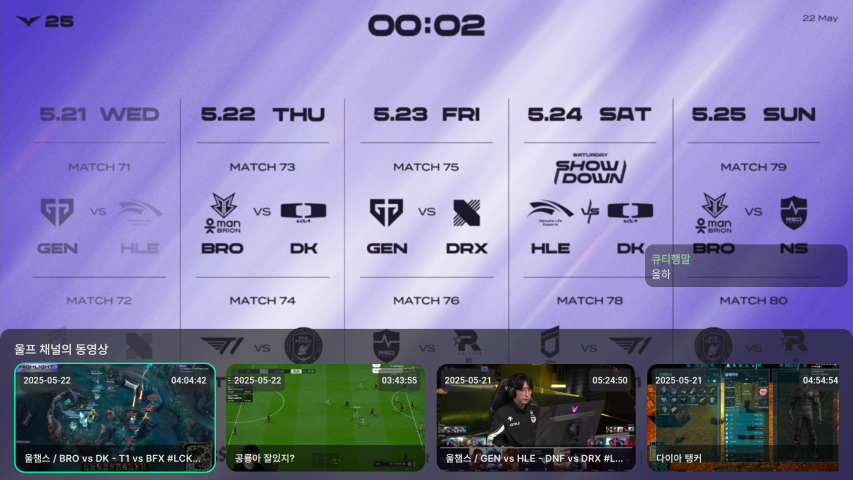

# 다시보기
VOD 다시보기에 대해 설명합니다.

- [다시보기 목록](#다시보기-목록)
- [조작법](#조작법)
    - [기본 컨트롤러](#기본-컨트롤러)
    - [넘기기](#넘기기)
    - [VOD 탐색](#vod-탐색)

# 다시보기 목록
다시보기는 홈 화면 상단 다시보기, 카테고리 다시보기, 팔로잉 채널, 검색 등에서 볼 수 있습니다.

# 조작법
## 기본 컨트롤러

    

:ok: 버튼을 눌러 기본 컨트롤러를 사용할 수 있습니다. 뒤로감기, 빨리감기, 일시정지, 재생 등 기능을 사용할 수 있습니다.

스트리밍 [설정](USAGE_SETTINGS.md)에서 **동영상 넘기기** 값을 조정하여 뒤로감기 | 빨리감기 버튼의 넘기기 시간을 조정할 수 있습니다.

## 넘기기

    
    

기본 설정 메뉴의 되감기 빨리감기 외에 다른 넘기기 방법을 소개합니다.

1. 전체 화면에서 :arrow_left::arrow_right: 버튼을 눌러 동영상을 넘깁니다. 길게 누르고 있으면 계속해서 넘기기가 적용됩니다.
2. 슬라이더를 활성화 시킨 후 :arrow_left::arrow_right: 버튼을 눌러 동영상을 넘깁니다. 슬라이더는 동영상이 길수록 더 많은 시간을 넘깁니다.
마찬가지로 길게 누르고 있으면 계속해서 넘기기가 적용됩니다. 

## VOD 탐색

    

:arrow_up: 버튼을 눌러 지금 시청하고 있는 채널의 동영상을 최신순으로 탐색할 수 있습니다.