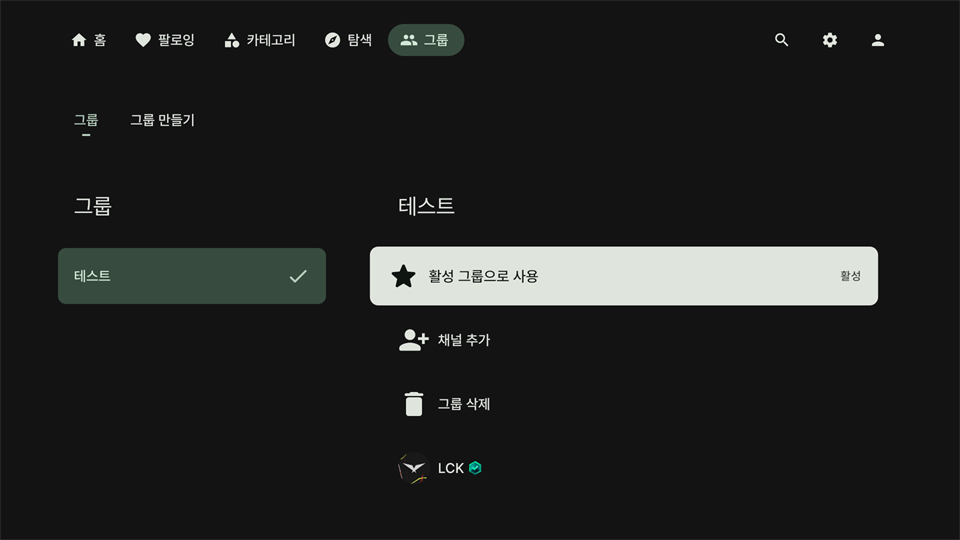

# 그룹 화면

    

커스텀 그룹을 추가하여 원하는 채널을 그룹화 할 수 있습니다.

그룹은 `채널`, `팔로잉-채널`, `라이브`, `동영상` 화면에서 추가할 수 있습니다.

`설정-라이브`에서 `플레이어 그룹 컨트롤 표시`를 켜고 그룹을 활성화하면 라이브 화면에서 :arrow_up: 버튼을 눌러 방송을 탐색할 때 활성화된 그룹의 라이브 채널 목록을 볼 수 있습니다.

생성된 그룹이 없다면 `그룹 만들기`탭에서 먼저 그룹을 만들어주세요.