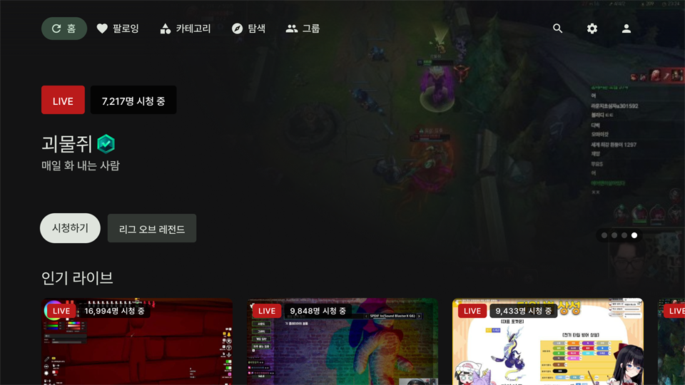
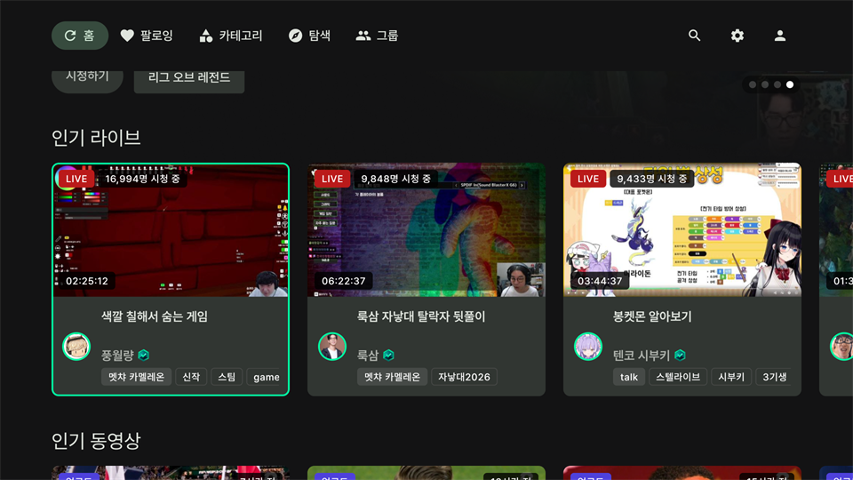

# 홈 화면

    

## 기본 조작법
- :leftwards_arrow_with_hook: 버튼으로 상단 네비게이션 바를 선택할 수 있습니다.
- :arrow_up::arrow_down::arrow_left::arrow_right: 버튼으로 포커스를 이동할 수 있습니다.

### 로그인
- 상단 네비게이션 바 우측 끝에 있는 로그인 아이콘을 선택하여 로그인 페이지로 이동합니다

### 앱 종료
- :leftwards_arrow_with_hook: 버튼으로 상단 네비게이션 바에 포커스를 준 다음 :leftwards_arrow_with_hook: 버튼을 2번 눌러 앱을 종료합니다.

## 컨텐츠

    

- 추천 방송, 인기 라이브, 인기 동영상, 인기 카테고리를 볼 수 있습니다.
- 로그인을 하면 팔로잉 라이브, 시청 기록, 팔로잉 카테고리를 볼 수 있습니다.
- (로그인 상태일 때) `설정-일반`에서 홈 화면 구성을 선택할 수 있습니다.