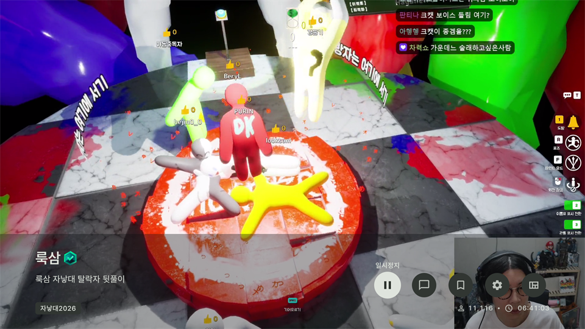
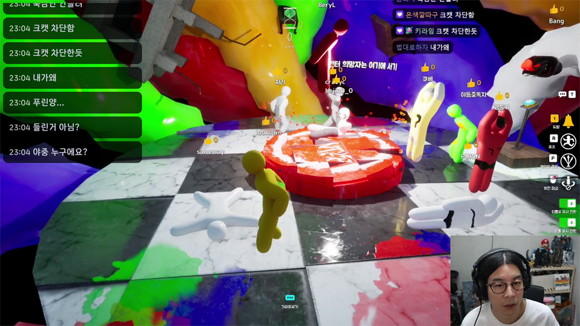
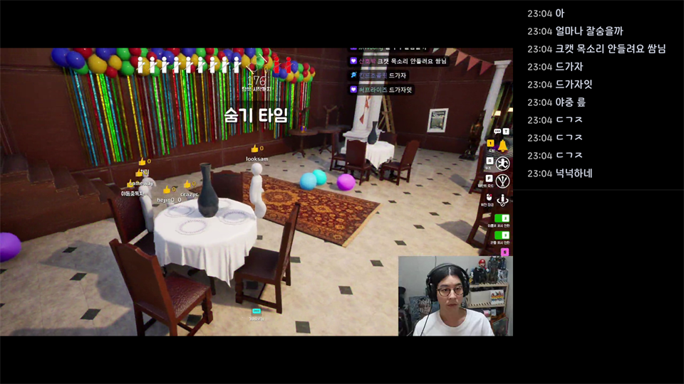
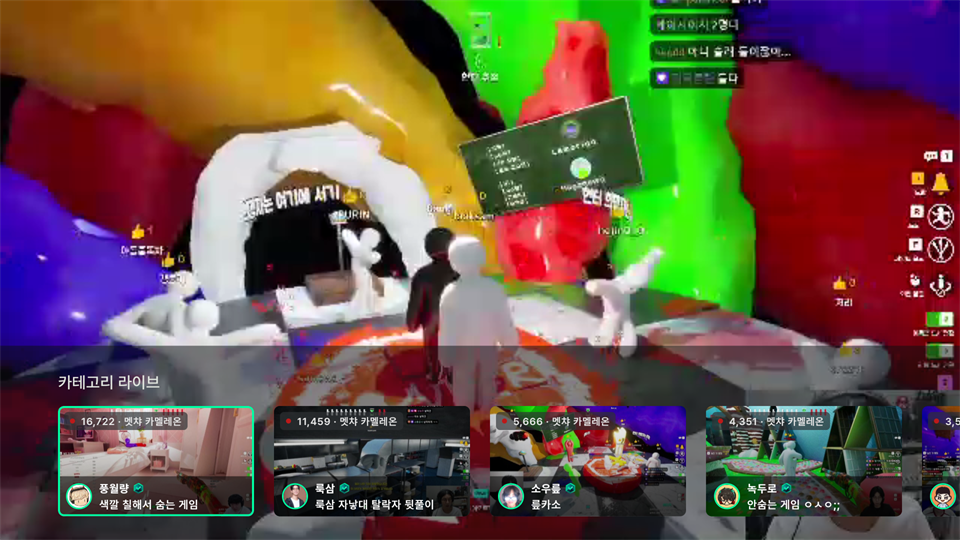
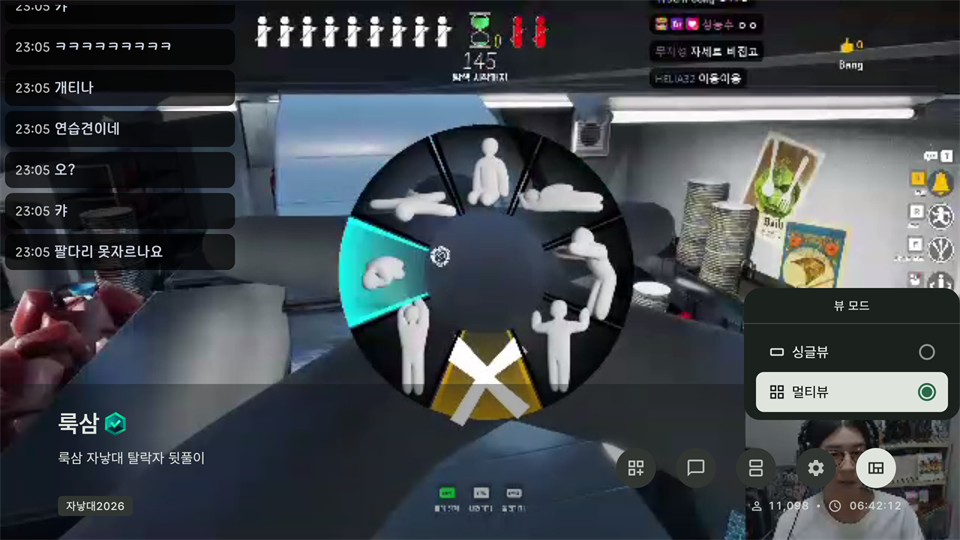
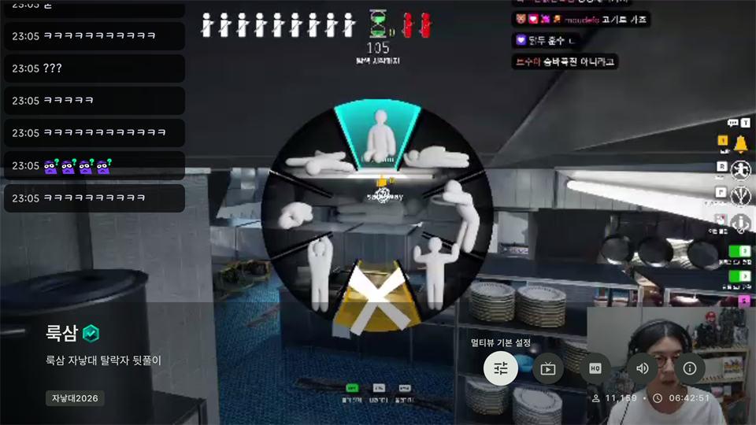
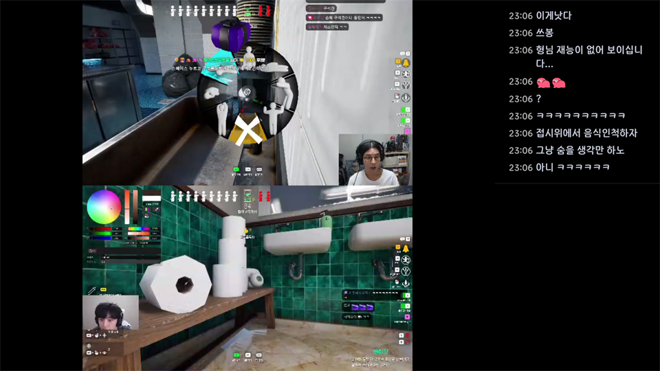
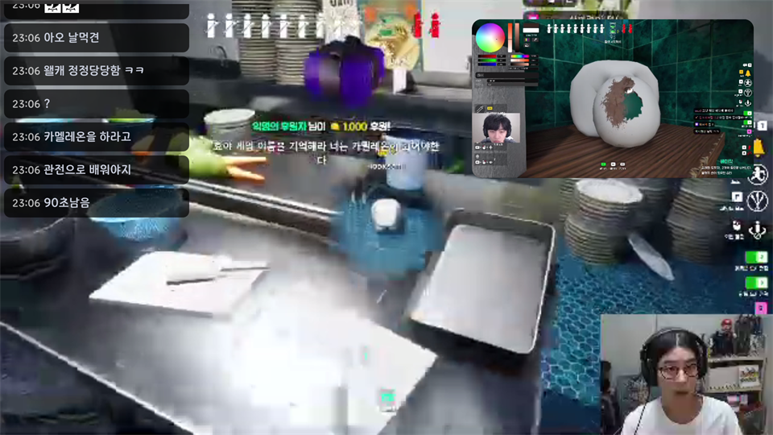
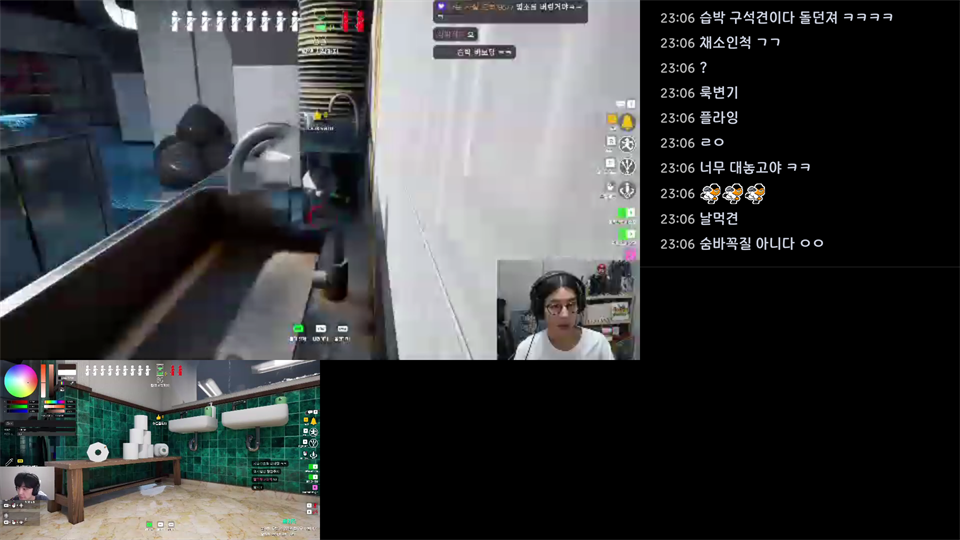

# 라이브 화면

    

## 싱글뷰 조작법
### 기본 컨트롤러
:ok: 버튼을 눌러 기본 컨트롤러를 열 수 있습니다. `재생/일시정지`, `채팅창 모드`, `즐겨찾기`, `설정`, `뷰 모드` 기능을 선택할 수 있습니다.

- 재생/일시정지: 화면을 `재생`/`일시정지`할 수 있으며, 45초 이상 일시정지 후 다시 시작하면 실시간 화면으로 이동됩니다. `실시간` 화면 기능도 제공됩니다.
- 채팅창 모드: 채팅창 표시 방법을 `오버레이`, `사이드`로 선택할 수 있습니다.
- 즐겨찾기: 채널을 `팔로우`하거나 `그룹에 추가`할 수 있습니다.
- 설정: `채팅 설정`, `화질 설정`, `소리 설정`, `그룹 설정` 기능이 있습니다.
- 뷰 모드: `싱글뷰` 또는 `멀티뷰`를 선택할 수 있습니다. 해당 모드를 선택하면 모드가 변경되고 조작법이 변경됩니다.

### 채팅창 켜기/끄기

    

    

:arrow_down: 버튼을 눌러 채팅창을 키거나 끌 수 있습니다. 마지막으로 선택된 채팅창 모드로 켜기/끄기가 반복됩니다.

`설정-채팅 설정`에서 설정한 값이 적용됩니다.

### 채팅창 빠른 이동
:arrow_left:, :arrow_right: 버튼을 눌러 채팅창 위치를 빠르게 변경할 수 있습니다. `오버레이` 모드일 때는 3x3 격자를 순회하며 위치가 변경됩니다. `사이드` 모드일 때는 사이드 채팅창 위치가 왼쪽/오른쪽으로 변경됩니다.

### 방송 탐색

    

:arrow_up: 키를 눌러 탐색 목록을 볼 수 있습니다. 탐색 목록이 활성화된 상태에서 :arrow_up:, :arrow_down: 버튼을 눌러 탐색 주제를 바꿀 수 있습니다.

- 로그인: 팔로잉 라이브, 인기 라이브, 카테고리 라이브, 그룹 라이브(그룹 설정이 켜졌을 때), 최근 시청 라이브
- 비로그인: 인기 라이브, 카테고리 라이브, 그룹 라이브(그룹 설정이 켜졌을 때), 최근 시청 라이브 

## 멀티뷰 조작법

    

`기본 컨트롤러`에서 `뷰 모드`를 `멀티뷰`로 선택하면 멀티뷰 모드로 진입하게 됩니다. 멀티뷰 모드 진입 후 :arrow_up: 버튼을 눌러 탐색창에서 방송을 추가합니다.

### 기본 컨트롤러

    

:ok: 버튼을 눌러 기본 컨트롤러를 열 수 있습니다. `멀티뷰 설정`, `멀티뷰 채팅 모드`, `화면 모드`, `설정`, `뷰 모드` 기능을 선택할 수 있습니다.

- 멀티뷰 설정: `멀티뷰 기본 설정`, `방송 종료`, `멀티뷰 화질 설정`, `멀티뷰 소리 설정`, `멀티뷰 방송 정보` 기능을 선택할 수 있습니다.
    - 멀티뷰 기본 설정: 오버레이 `멀티뷰 채팅 위치`, `PIP 화면 크기/위치`를 설정합니다.
    - 방송 종료: 선택한 방송을 멀티뷰에서 제외합니다.
    - 멀티뷰 화질 설정: 방송별로 화질을 설정합니다.
    - 멀티뷰 소리 설정: 방송별로 소리를 키거나 끕니다.
    - 멀티뷰 방송 정보: 전체 방송 정보를 보여줍니다.
- 멀티뷰 채팅 모드: `오버레이`, `사이드` 모드를 선택할 수 있습니다. 특정 화면 모드에서는 설정값과 관계없이 정해진 방식대로 나타납니다.
- 화면 모드: `PBP`, `PIP`, `포커스` 모드를 선택할 수 있습니다.
- 설정: 싱글뷰 설정과 동일합니다.
- 뷰 모드: `싱글뷰` 또는 `멀티뷰`를 선택할 수 있습니다. 해당 모드를 선택하면 모드가 변경되고 조작법이 변경됩니다.

### 채널 활성화
:arrow_left:, :arrow_right: 버튼을 눌러 활성화할 채널을 선택합니다. 활성화된 채널은 몇 초간 초록색 테두리가 보이게 됩니다.

### 화면 모드 변경
:arrow_down: 버튼을 눌러 화면 모드를 변경합니다.

### PBP

    

화면을 균등하게 보여줍니다. 멀티뷰가 2개 이하로 재생될 때 사이드 채팅 모드를 선택할 수 있습니다.

### PIP

    

화면 속 화면 기능입니다. 오버레이 채팅만 지원합니다.

### FOCUS

    

활성화된 화면만 크게 봅니다. 사이드 채팅만 지원합니다.