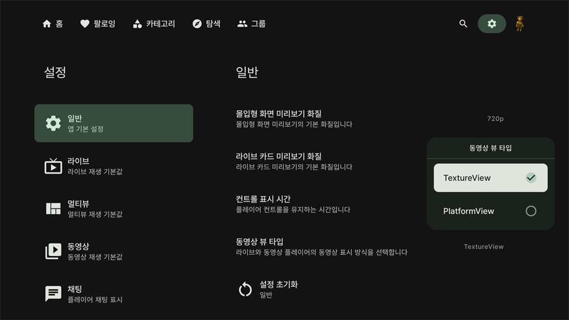
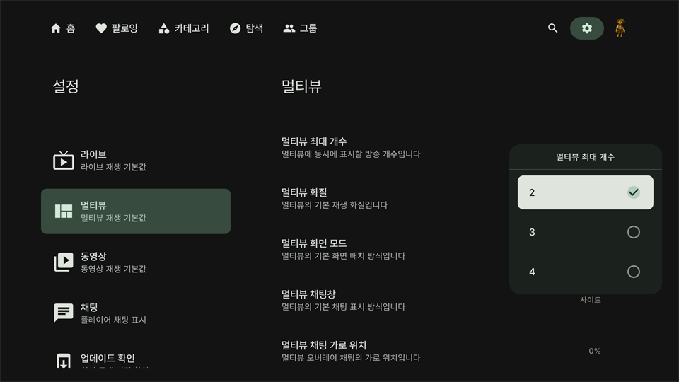
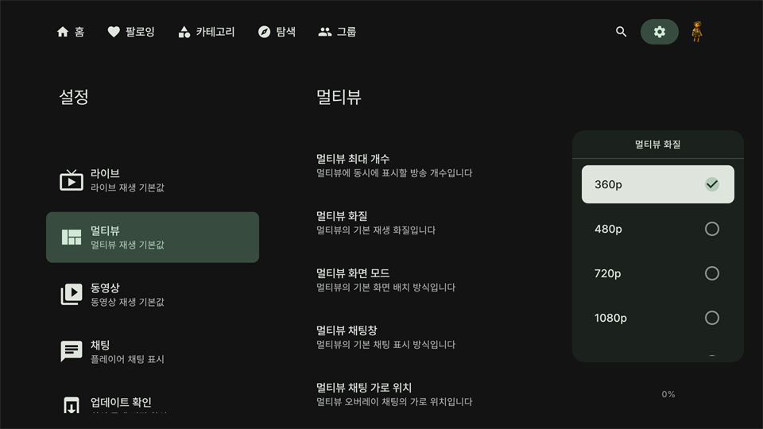
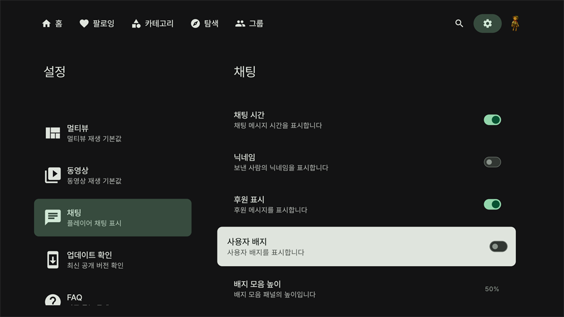
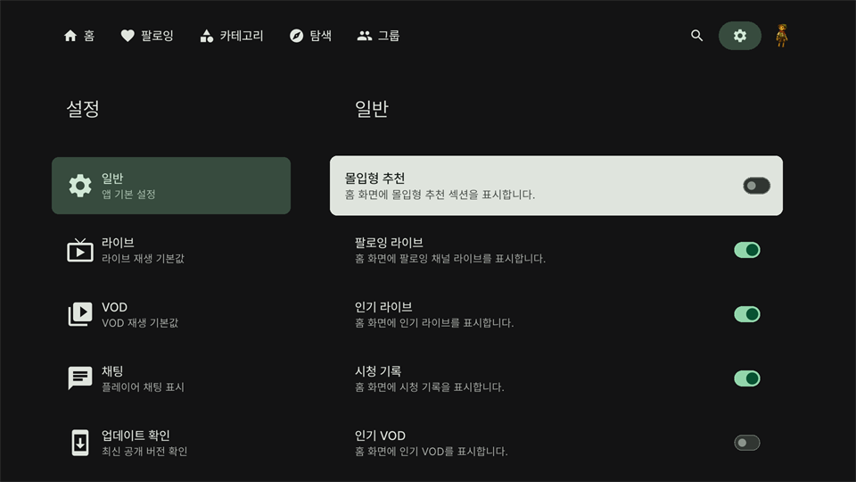

# 성능 문제 해결방법
## ENGINE 선택
저사양 또는 구형 티비를 사용하시는 경우 화면이 이상하게 보인다면 SKIA 엔진 버전으로 설치해주세요.

## 프레임 드랍

    

프레임 드랍 현상이 지속적으로 나타난다면 `설정-일반`에서 `동영상 뷰 타입`을 `PlatformView`로 선택해주세요.

## 멀티뷰 성능

    

    

멀티뷰는 기기에 부담이 매우 심한 기능입니다. 멀티뷰 최대 개수를 2개로 설정하여 사용해주세요.

또한 멀티뷰 해상도를 최저로 낮춰 사용해주세요.

## 렌더링

    

`설정-채팅`에서 `사용자 배지` 기능을 꺼서 기기에 부담을 줄여주세요.

## 기타

    

`설정-일반`에서 `몰입형 추천`을 꺼주세요.