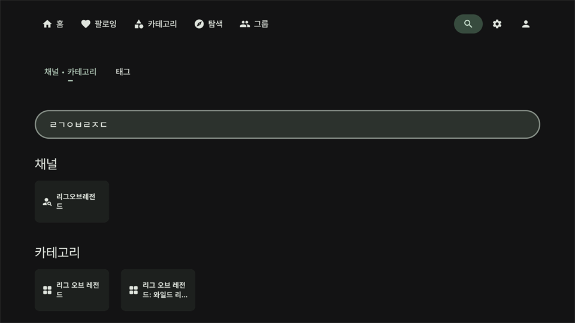
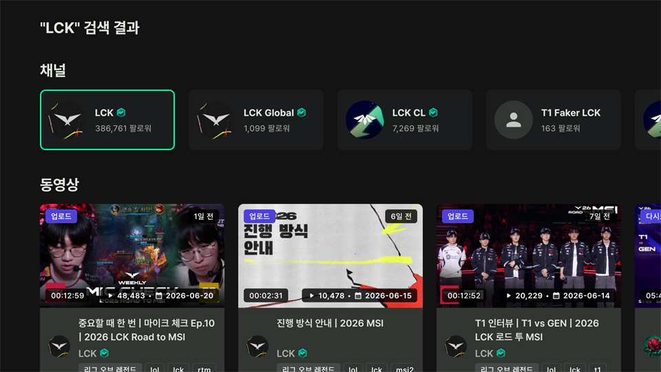
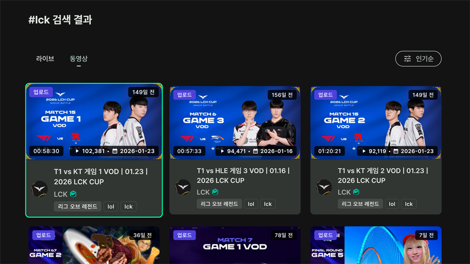

# 검색 화면

    

`채널 & 카테고리`와 `태그`를 검색할 수 있습니다. 가상 키보드의 엔터 버튼을 눌러 검색 결과 화면으로 이동하거나, `자동완성` 목록에서 아이템을 선택하여 검색 결과 화면으로 이동할 수 있습니다. 

# 채널 & 카테고리 검색 결과 화면

    

채널, 라이브, 동영상 검색 결과를 확인할 수 있습니다.

# 태그 검색 결과 화면

    

해당 태그가 적용된 라이브, 동영상을 `인기순/최신순`으로 볼 수 있습니다.