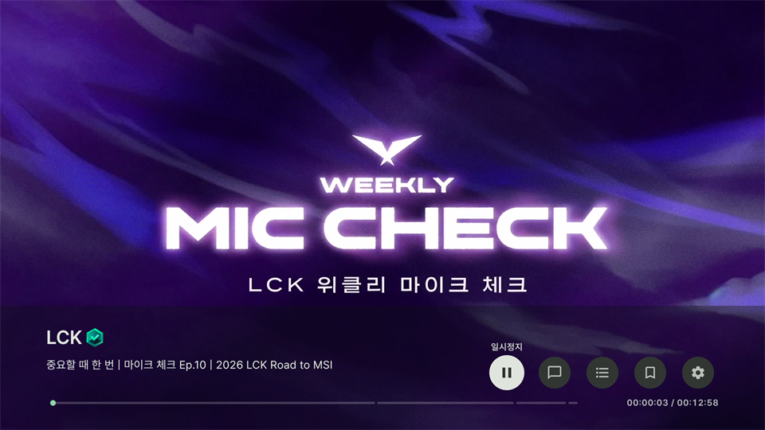
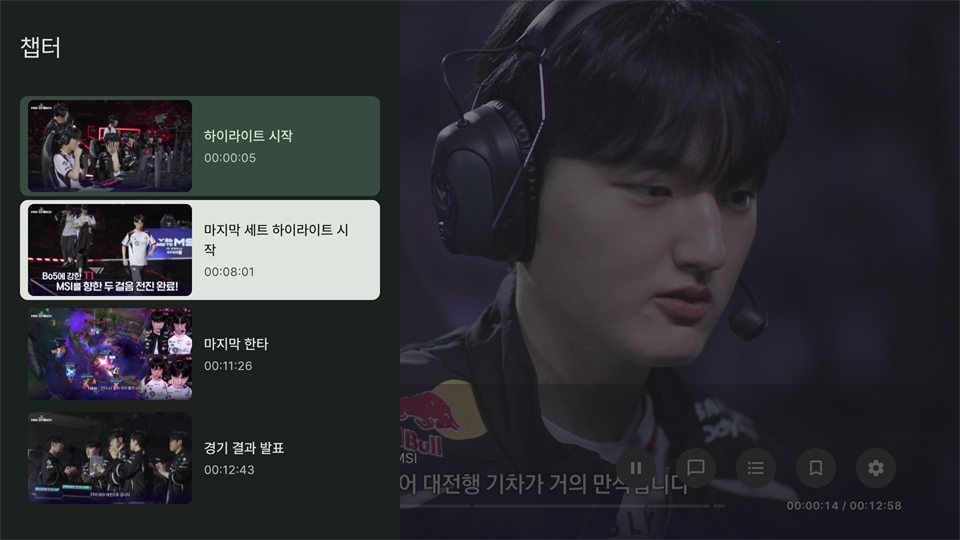
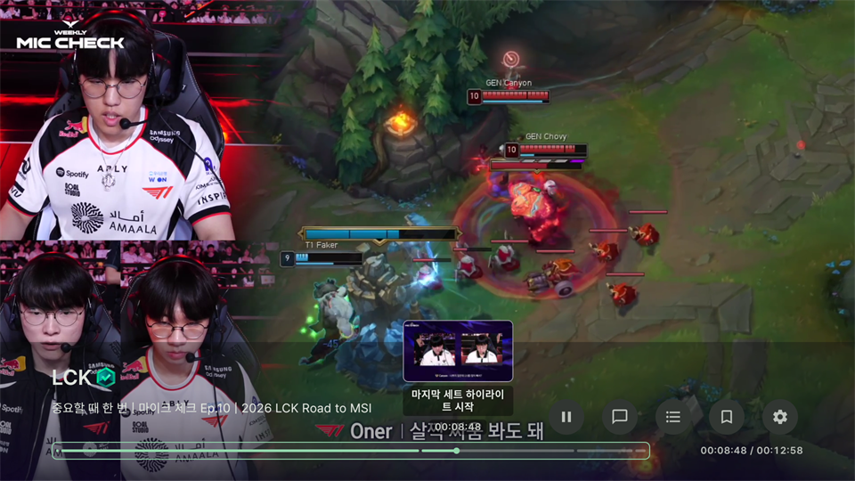
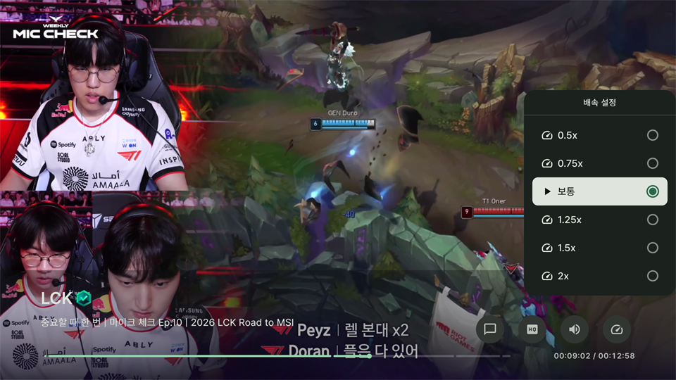
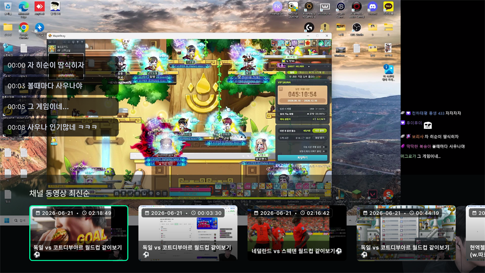

리모컨 6개 ( :arrow_up: 위, :arrow_down: 아래, :arrow_left: 좌, :arrow_right: 우, :ok: 확인, :leftwards_arrow_with_hook: 뒤로가기 ) 버튼을 사용하여 조작합니다.

# 동영상 화면

    

## 조작법
### 기본 컨트롤러

    

    

    

:ok: 버튼을 눌러 기본 컨트롤러를 열 수 있습니다. `재생/일시정지`, `채팅창 모드`, `챕터`, `즐겨찾기`, `설정` 기능을 선택할 수 있습니다.

하단 탐색 바를 통해 빠른 이동을 할 수 있습니다. 탐색 바가 선택된 상황에서 좌/우 버튼으로 되감기/빨리감기가 가능합니다. 계속 키를 누르고 있으면 가속됩니다.

- 재생/일시정지: 동영상을 재생/일시정지 할 수 있습니다.
- 채팅창 모드: 채팅창 표시 방법을 `오버레이`, `사이드`로 선택할 수 있습니다.
- 챕터: 챕터가 활성화된 동영상에서 챕터를 선택하여 빠른 이동을 할 수 있습니다.
- 즐겨찾기: 채널을 `팔로우`하거나 `그룹에 추가`할 수 있습니다.
- 설정: 설정: `채팅 설정`, `화질 설정`, `소리 설정`, `배속 설정` 기능이 있습니다.

### 되감기/빨리감기
:arrow_left:, :arrow_right: 버튼을 눌러 설정된 값에 따라 되감기/빨리감기를 할 수 있습니다. 탐색 바와 달리 가속은 되지 않습니다. 세밀한 이동에 사용하세요.

### 채팅창 켜기/끄기
:arrow_down: 버튼을 눌러 채팅창을 키거나 끌 수 있습니다. 마지막으로 선택된 채팅창 모드로 켜기/끄기가 반복됩니다.

### 탐색

    

:arrow_up: 키를 눌러 해당 채널의 동영상 목록을 최신순으로 볼 수 있습니다.